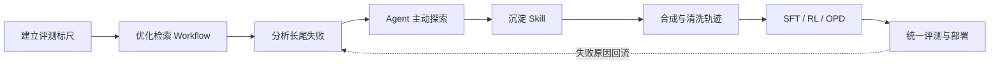

# 金融取数 Agent 演进复盘

> 我在金融取数项目中的技术复盘与学习笔记：评测与检索优化 → 长尾 Agent 与 Skill → 数据、训练、评测和部署。

我接手时，系统已经有一条“多维向量召回—综合打分—Top1 取数”的快速 Workflow。我的工作从建立 LLM Judge、分析错误和改造这条链路开始。随后，跨地区、多指标和需要纠错的长尾问题推动我引入目录树 Agent，并把寻址经验沉淀为 Skill。第三阶段，我完成了数据合成与轨迹处理、全参数 SFT、LoRA RL、在线策略蒸馏（OPD），以及 checkpoint 转换、部署和统一评测。

这里按“我看到什么问题、为什么这样判断、具体怎么改、结果说明什么”记录这段过程，供自己复习，也方便读者沿着一个问题继续看实现细节。

第一次阅读，先看[底层数据与目录结构](docs/00-project-map.md#0-底层数据与目录结构)：指标记录、目录节点和实际数值怎样关联，以及接口中能观察到的结构问题。

## 三个阶段，我分别做了什么

| 阶段 | 遇到的问题 | 我的工作与产出 | 继续阅读 |
| --- | --- | --- | --- |
| 阶段一：评测基建与 Workflow 优化 | 候选语义相关，却不满足地区、时间或统计口径；新旧方案缺少可靠比较 | 构建 Judge，改造既有 Workflow，加入问题拆解、多路召回、候选聚合与可回放验证 | [检索与 Judge](docs/01-retrieval-workflow.md) |
| 阶段二：长尾 Agent 与 Skill 沉淀 | 扩大 TopK 仍会遗漏目标，固定流程难以探索与恢复 | 构建目录树寻址 Agent，迭代候选重排、兄弟节点探索、空结果回退和参数约束，沉淀 Skill 与轨迹评测链路 | [Agent 与 Skill](docs/02-agent-and-skill.md) |
| 阶段三：训练数据闭环与模型能力内化 | 外部强模型能够验证方案，但成本、延迟和承载能力需要进一步优化 | 完成 QA 合成、Teacher 轨迹转换、全参数 SFT、MoE LoRA RL、4B OPD、训推对齐、部署与多 Skill 评测 | [数据](docs/03-data-and-trajectory.md) · [训练](docs/04-sft-opd-rl.md) · [评测与部署](docs/05-evaluation-and-deployment.md) |

第三阶段包含不同基座的实验线。SFT、LoRA RL 与 OPD 的方法可以共享数据处理与评测经验，不能理解成一个模型依次换大小、串行完成所有训练。

## 阶段结果

以下是不同实验的历史快照，不能跨行拼成一条准确率提升曲线。

| 实验 | 记录的结果 | 解释范围 |
| --- | --- | --- |
| 高频取数 Workflow | 1,385 条问句，平均口径 61.48% → 79.32%，+17.84 个百分点 | 同一阶段的新旧 Workflow 对比；三种判分口径见第一章 |
| 早期目录树 Agent | 指标集合 F1 71.31 → 91.68，+20.37 个百分点 | 单项任务的整体方案收益，未拆分四类修复的独立贡献 |
| 数据建设 | 约 10,000 条候选 QA → 4,251 条；约 6,400 条多 Skill SFT 数据 | QA 与训练轨迹是不同资产，两组数字不构成直接换算关系 |
| 多 Skill 后训练总览 | 4B：63.28 → 67.97；35B：72.06 → 73.81 | Claude Code SDK、六类任务；源表标注为 SFT/RL，具体 checkpoint 与后续 OPD 实验的映射见实验索引 |

结果的来源层级、已知条件和解释边界统一放在 [实验与数据口径索引](docs/06-experiment-index.md)。降低成本与延迟是第三阶段的目标；这里没有把缺少同口径性能记录的估计写成已验证收益。

## 怎么读这份笔记

- **先看项目全貌**：[个人工作、关键选择与一个完整 Case](docs/00-project-map.md)。
- **想理解技术路线**：按第一章到第五章顺序阅读，每章都从问题讲到结果和局限。
- **重点看模型训练**：从第三章的数据与协议开始，再按第四章的 SFT → RL → OPD 理解训练动机与监督信号，公式和工程配置可展开查看，最后看第五章的部署验收。
- **核对某个数字**：[实验与数据口径索引](docs/06-experiment-index.md)。

## 我在项目中反复用到的判断

1. **先评准，再优化。** 指标 ID 不同，数据仍可能足以回答问题；Judge 与任务 reward 各自能判断什么，需要说清楚。
2. **按错误发生的位置改。** 没召回、排错、参数错、提前停止和部署解析失败，需要不同的修复。
3. **总分与轨迹一起看。** 分数说明变化，轨迹帮助归因；单个成功 Case 不能代替全量回归。
4. **权重与执行协议一起验收。** tokenizer、template、parser、Skill 和 Runtime 都会影响最终表现。

## 公开范围

这是重新撰写的技术复盘，包含通用流程图、合成 Case 和解释性伪代码，不是原系统的源码镜像或可直接运行的金融数据产品。原始数据、内部 Prompt 与 Skill、真实工具 Schema、服务配置、凭据和模型权重不在仓库中。具体范围见 [内容边界与脱敏说明](SECURITY_REVIEW.md)。
