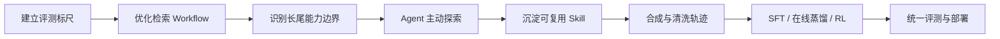

# 金融取数 Agent 演进复盘

> 从检索工作流、Agent Skill 到专用小模型训练的个人学习笔记。

这不是某个公司内部系统的源码镜像，也不是一套可以直接连接真实金融数据的产品。它记录的是我在金融取数 Agent 项目中逐步解决问题的思路：先建立可靠的评测标尺，再优化高频检索链路；当固定 Workflow 遇到长尾瓶颈后，引入具备主动探索能力的 Agent；最后将 Agent 轨迹转化为训练数据，把能力内化到更低成本的专用模型。

所有示例均经过重新编写，不包含真实业务数据、内部工具地址、账号凭据、原始 Prompt、模型权重或公司源码。

## 项目演进

| 阶段 | 要解决的问题 | 主要产出 |
| --- | --- | --- |
| 评准与检索优化 | 如何判断结果是否真正回答问题，已有召回链路错在哪里 | LLM Judge、可回放验证 Workflow、召回与候选聚合优化 |
| Agent 化与 Skill 沉淀 | 固定 Workflow 如何处理跨节点、多目标和长尾查询 | 目录树寻址 Agent、Skill、轨迹采集与 Badcase 迭代 |
| 数据与模型训练 | 如何降低外部大模型的成本与延迟 | QA/轨迹数据、SFT、在线策略蒸馏、LoRA RL、统一评测与部署 |

## 当前内容

- [第一阶段：先把检索工作流评准，再谈优化](docs/01-retrieval-workflow.md)
- [第二阶段：让 Agent 沿目录主动寻址，并把方法沉淀成 Skill](docs/02-agent-and-skill.md)
- [第三阶段（上）：从问题种子到可训练 Agent 轨迹](docs/03-data-and-trajectory.md)
- [第三阶段（中）：SFT、在线策略蒸馏与 Agent 强化学习](docs/04-sft-opd-rl.md)
- [第三阶段（下）：统一评测、Checkpoint 转换与部署闭环](docs/05-evaluation-and-deployment.md)

## 贯穿项目的三个原则

### 1. 先评准，再优化

如果评测只能比较字符串或指标 ID，就无法识别“结果不同但仍足以回答问题”的情况。没有可靠 Judge，后续所有优化都缺少稳定反馈。

### 2. 先定位错误层，再选择技术方案

正确候选没有进入 TopK、进入 TopK 但没有成为 Top1、以及 Top1 正确但执行失败，是三类不同问题。它们分别对应召回、排序和执行链路，不应该用同一种方法处理。

### 3. 用 Case 推动路线演进

从 Workflow 转向 Agent、再从外部 Agent 转向专用模型，不是为了堆叠技术名词，而是因为上一阶段在真实 Case 上出现了可重复的能力边界。

## 公开范围

本仓库只保留通用架构、重新编写的示例、可解释的实验方法和个人学习总结。具体保留与省略范围见 [内容边界与脱敏说明](SECURITY_REVIEW.md)。
