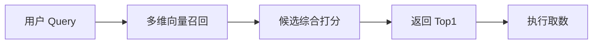
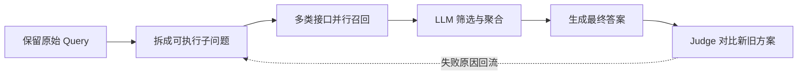

# 第一阶段：先把检索工作流评准，再谈优化

> 口径说明：本章数字是项目阶段快照，用于解释技术判断，不代表公开基准或线上长期指标。

## 1. 我接手的系统已经有一条快速链路

我最开始并不是从零搭建取数系统。已有方案大致是：



我的工作是分析这条链路为什么会错，再针对召回、排序和执行环节优化 Workflow。

它对高频、单目标问题比较有效，但隐含了一个不总是成立的假设：**语义最相似的候选，就是业务上正确的指标。** 金融问题还包含地区、频率、单位、时间范围和统计口径等约束。只要漏掉其中一项，候选看起来很相关，实际仍可能无法回答问题。

## 2. 第一件事不是改召回，而是建立 Judge

假设用户询问某一季度的总销量，标准答案使用季度累计指标，而模型返回了该季度三个月的月度值。

严格比较指标 ID 会判错，因为模型没有返回同一个指标。但如果三个月都是同单位、同统计范围的当月值，且无缺月、重叠或重复，便可以求和得到季度总量。这个判断不适用于存量、比率，或已经累计过的月度指标。

因此，评测需要判断的不是“预测是否和标准答案一模一样”，而是：

> 当前返回的数据，能不能可靠地回答用户问题？

我使用 LLM-as-a-Judge 补充判断指标名称、频率、单位、时间范围和可计算关系，并通过人工争议 Case 迭代判定规则。后续独立 100 条复测中，Judge 与人工判定一致率达到 93%。这批复测与前期迭代样本不同，一致率也不是取数系统的业务正确率。公开材料没有提供类别分布和混淆矩阵，因此不能进一步推出误判正例、误判负例各有多少。

Judge 的作用不仅是给出分数。它让新旧方案能够使用同一把尺子比较，也让失败原因可以回流到召回、拆解和提示配置中。

## 3. 一个 Case 如何暴露语义召回的局限

下面使用一个重新编写的示例：

```text
问题：某国每年从贸易伙伴 A 进口某类商品多少？

语义 Top1：该国该商品进口总量
正确口径：该国该商品从贸易伙伴 A 的进口数量累计值
```

语义 Top1 命中了“国家、商品、进口、数量”，但没有满足“贸易伙伴 A”的限制。它说明语义相关性和业务条件满足程度不是一回事。

进一步看完整候选后，可以把问题分成三层：

| 观察到的现象 | 更可能的问题 | 优先检查的环节 |
| --- | --- | --- |
| 正确指标没有进入任何一路 TopK | 召回覆盖不足 | Query 表达、召回通道、索引描述 |
| 正确指标已经进入 TopK，但没有排到 Top1 | 候选区分度不足 | 综合打分、业务条件判断 |
| Top1 指标正确，但最终数据或答案错误 | 执行链路错误 | 参数、时间范围、聚合计算、工具调用 |

这是根据 Case 得到的工程归因框架，不是严格的因果消融。它的价值在于避免把所有错误都简单归咎于 embedding。

## 4. 将线上输入输出搬进可回放 Workflow

优化后的验证链路是：



每条样本保留输入、工具调用、候选结果、最终答案和 Judge 判因。这样，指标下降时能够回到证据链定位问题，而不是只得到一个“错”的标签。

在 1,385 条真实分布问句上，结果如下：

| 评测口径 | 原方案 | 优化后 |
| --- | ---: | ---: |
| 严格口径 | 53.57% | 74.66% |
| 平均口径 | 61.48% | 79.32% |
| 最高口径（源表名称） | 69.39% | 83.97% |

按源表的平均口径，正确率提升 17.84 个百分点，说明传统检索链路仍然存在明显的工程优化空间。

这里保留“严格、平均、最高”三个历史名称。当前公开材料没有附完整判分函数，所以不能仅根据数字关系，把平均口径定义为上下界均值，或把最高口径解释成理论上界。前面的季度/月度示例只解释 Judge 的业务动机；三种历史口径的结果与边界统一见 [实验索引 E2](06-experiment-index.md)。

## 5. TopK 实验告诉我的不只是参数应该设多少

| 候选深度 | 平均正确率 |
| ---: | ---: |
| Top40 | 78.81% |
| Top10 | 79.32% |
| Top5 | 79.10% |

Top10 与 Top5 只差 0.22 个百分点，继续扩大到 Top40 也没有更好。在这轮固定方案与数据上，没有观察到扩大候选深度的明显收益。候选噪声是一种可能解释，仍需候选分析或消融支持；这些结果也不足以证明 Top10 显著优于 Top5，或检索路线已经达到普遍上限。

与此同时，跨地区批量取数、多个相关指标组合和模糊表达仍然需要模型主动拆解、探索与纠错。它们不是一次 TopK 召回自然能够解决的问题。

所以这一阶段的最终判断是：

> 优化后的 Workflow 适合高频、单目标问题；对于需要多步探索的长尾问题，应该保留快速链路作为候选方案，同时引入能够沿结构主动寻址的 Agent。

这成为下一阶段转向目录树 Agent 和可复用 Skill 的直接原因。

## 6. 这一阶段留下的方法论

1. 先建立可信评测，再谈模型或 Workflow 优化。
2. 把召回、排序和执行错误分开，不用单一指标解释所有失败。
3. 总分判断是否变化，完整轨迹和 Badcase 解释为什么变化。
4. TopK 敏感性用于观察当前配置的候选深度收益，并与长尾失败轨迹一起支持下一步技术判断。
5. 技术路线的切换应由可复现的 Case 和实验现象推动，而不是由框架热度推动。

---

[返回首页](../README.md) · [项目地图](00-project-map.md) · [实验与数据口径](06-experiment-index.md)
