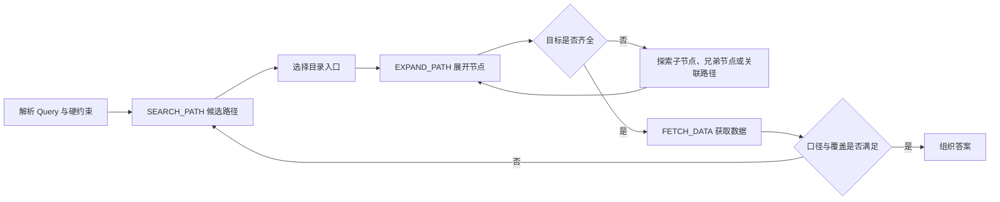
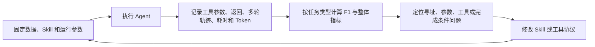

# 第二阶段：让 Agent 沿目录主动寻址，并把方法沉淀成 Skill

> 口径说明：本章数字是项目阶段快照；示例已经重新编写，不对应真实客户或原始业务数据。

## 1. 为什么优化后的检索 Workflow 仍然不够

第一阶段解决了大量高频、单目标问题，但剩余 Badcase 中出现了一类不同的任务：用户不是寻找一个指标，而是要求覆盖多个地区、多个口径或一组相关目标。

例如：

> 查询某城市全部下属地区在指定季度的同一经济指标及其累计同比。

这类问题至少包含三步：先确认下属地区集合，再为每个地区定位相同口径的指标，最后检查结果是否完整。多次改写 Query 可能召回大量重复候选，却没有增加实际地区覆盖。

结合当时 TopK 实验没有明显增益，以及剩余 Case 的覆盖与恢复问题，我得到的工程判断是：

> 长尾取数不只是相关性排序问题，还需要在结构化空间中探索、记住已经覆盖的目标，并在局部失败后换路径继续找。

因此，第二阶段引入目录树寻址 Agent，专门补足需要多步探索的任务。这个选择由候选实验与失败轨迹共同支持，不能仅由三个 TopK 分数推出。

## 2. 目录是已有条件，优化发生在 Agent 侧

Agent 侧复用底层指标库已有的分类和父子关系：搜索结果带回指标及其父节点信息，再用这个入口列出同一目录下的相关指标。因此，查询时只读取局部目录，不需要把约 900 万指标装进上下文。

这些分类节点、指标 ID 和元数据由底层数据服务提供，我们通过工具读取和使用。下面是简化示意：

```text
地区经济 → 某来源 → 某经济指标
                   ├── 地区 A：季度累计值 → 指标 ID
                   ├── 地区 B：季度累计值 → 指标 ID
                   └── 地区 A：季度累计同比 → 另一个 ID
```

这里长期存在底层数据治理不足的问题。**一个实体对应多个指标本身很正常；难点是别名、重复记录和口径混杂，使目录入口不能唯一确定答案。** 例如，搜到“地区 A”的累计值，并不代表已经找到它的累计同比；同一主题还可能散落在不同来源的目录里。

**底层数据治理不在我们可改的范围内，所以这一阶段的工作，是让 Agent 在现有目录和数据条件下查得更准、更有效率。** 同父节点用于缩小候选范围，具体指标仍逐项核对；一条路径找不齐，就利用已命中的指标名称和其他入口补搜。改动落在 Skill 的搜索策略、候选判断、失败恢复和工具执行上。

## 3. `SEARCH_PATH → EXPAND_PATH → FETCH_DATA` 的 Agent 循环

下面三个名称是为了公开说明流程而使用的通用代称，不对应真实接口名或参数 Schema。



| 动作 | 主要输入 | 主要输出 | 作用 |
| --- | --- | --- | --- |
| `SEARCH_PATH` | 主题、地区、指标名等 Query 信息 | 候选目录路径 | 决定从哪里开始找 |
| `EXPAND_PATH` | 已选中的目录路径 | 子节点或关联项 | 看清当前节点下面有什么 |
| `FETCH_DATA` | 已确认指标与查询参数 | 最终数据 | 完成真实取数 |

`SEARCH_PATH` 仍然可以使用语义召回，但召回对象变成了路径入口，而不是要求一步命中最终指标。Agent 根据每次工具返回决定下一步是否继续展开、转向兄弟节点或重新搜索。

因此，Agent 的核心不是一次生成更多 tool call，而是把一次性排序改造成带状态的多轮决策。

## 4. 怎样避免在 900 万指标里一直找

自由探索容易出现两种失败：找到几个结果就结束，或者不断换词、展开目录却迟迟无法回答。后续 Skill 把流程收紧为：**先定目标，再定向搜索，沿同源目录补齐，只为缺项继续探索。**

以一个合成任务为例：查某城市 A、B、C、D 四个下属地区的季度累计值及累计同比。

1. **先算清要找什么。** 根据地区标准表确认范围，列出“4 个地区 × 2 个口径”的 8 项清单。不能拿搜索命中的地区反推“全部地区”。
2. **定向召回。** 按地区和口径组织搜索，独立请求并发执行，每项先看少量候选，避免泛搜整个主题。
3. **用已命中项补齐。** 假设确认了 A、B 的累计值，就展开对应的同源目录，筛出 C、D；累计同比单独匹配，不能从累计值路径直接推断。
4. **只处理缺项。** 若只缺 D 的累计同比，就参考已确认的“地区 A：某指标：累计同比”，替换地区定向补搜。目录为空先检查过滤条件和入口；取数为空先检查时间范围，分别恢复。
5. **批量取数并核对。** 已确认 ID 交给脚本批量执行，再核对返回指标名和时间。缺项要列明；需要全体参与的排名不能用部分结果冒充完整排名。

这样限制的是模型要判断的候选范围，底层检索仍然覆盖大库。并发减少串行等待，同源补齐减少重复搜索；并发本身并不减少请求总量。

停止也需要两层约束：Skill 规定“完整覆盖才算完成，无法确认则报告缺失”；执行层设置超时或轮数上限兜底。现有评测支持配置超时，但默认不启用，尚不能说耗时已经被严格控制。按任务规模设预算、遇到重复无增益动作提前退出，仍是需要补齐的优化。

## 5. Skill 怎样从补规则，变成减少无效动作

对照早期 Skill 与本次评测入口使用的版本，变化主要体现在下面几处。这些是逐步迭代的策略，不能都算到早期一次实验里。

| 遇到的问题 | 早期处理 | 后续变化与作用 |
| --- | --- | --- |
| 候选相似但口径不对 | 改写 Query、候选重排 | 搜索前拆清主体和口径，维护目标到 ID 的映射，减少取错后重来 |
| 找到部分地区就结束 | 提醒继续找兄弟节点 | 先固定目标集合，取数前后核对覆盖，补搜只围绕缺项 |
| 反复改词仍找不齐 | 把目录展开作为可选动作 | 优先沿已命中的同源目录补全，仍缺失时复用指标名称结构定向补搜 |
| 空结果后反复重查 | 泛化地重试或换路径 | 区分搜索为空、目录为空和日期无数据，检查对应条件，减少无关重试 |
| 多目标逐项等待 | 模型逐项组织调用 | Skill 要求独立搜索并发执行；确认 ID 后交给脚本批量取数 |

工具侧也承担了一部分工作：候选按 ID 去重，结合原始问题默认做本地重排；再通过条数限制、目录过滤和精简字段减少模型阅读量。这些动作不必都交给模型多想一轮。

代价仍然存在：多主体全量搜索会增加请求数，严格匹配会增加判断，截断的结果也不能直接当作全部候选。因此，“查得更准”和“每次都更快”需要分别验证。

下一步更值得做的是把稳定操作交给代码：批量执行已有实现；覆盖集合求差、重复动作检测等还应进一步下沉。模型保留口径判断和补搜选择，避免每加一条检查就增加一轮推理。验收时要一起看覆盖率、调用次数、耗时和 Token，目前没有各项改动的独立提速数据。

## 6. Agent Runtime 是什么

Runtime 就是让模型和工具持续配合工作的执行程序。模型输出“调用搜索”后，Runtime 真正运行工具，把结果接回对话，再请求模型决定下一步；直到模型回答、执行失败或触发停止限制。

项目使用过 Claude Code SDK 和 OpenCode 承担这个角色。Skill 是模型读取的任务操作说明，规定怎么查、如何处理缺项；Runtime 负责把这些决策执行起来。换模型、换 Skill、换 Runtime 都可能改变结果，因此评测需要分别记录。

## 7. 一次调用里，各部分具体干什么

仍以上面的 8 项取数任务为例，假设现在只确认了 7 项：

| 环节 | 具体动作 |
| --- | --- |
| Skill 提供策略 | 要求检查目标覆盖，优先沿已命中的同源目录补齐 |
| 模型作决定 | 判断缺的是 D 的累计同比，选择相关目录并生成调用参数 |
| Runtime 执行动作 | 运行目录查询工具，将成功结果或错误信息送回模型 |
| 工具访问数据 | 根据指定目录返回候选；ID 确认后，脚本批量查询时间序列 |
| 模型继续判断 | 核对返回项是否为 D 的累计同比，再决定取数、补搜或说明缺失 |
| 评测程序验收 | 保存这条调用轨迹，核对最终指标集合，统计分数、调用次数与耗时 |

我的工作落在拆解 Badcase、修改 Skill 的搜索与完成策略、调整工具执行方式，以及接入两类 Runtime 做回归。例如，漏了 D，就检查目标清单、召回结果和停止位置；如果返回了错误口径，就检查候选匹配和 ID 映射。这样才能确定下一轮到底改哪里。

## 8. 用完整轨迹迭代，而不是只看最终答案



最终答案能判断任务是否完成，完整轨迹才能解释为什么成功或失败。它还让局部修复能够做全量回归，避免某条 Badcase 修好后破坏其他类型的任务。

这套 Harness 与 Scorer 后来也成为训练阶段的统一验收入口：模型无论经过监督微调、在线策略蒸馏还是强化学习，都要回到同一批任务和同一套 Skill 中比较，而不能只看训练 loss。

## 9. 阶段结果与下一步问题

早期单项能力迭代记录中：

| 方案 | F1 |
| --- | ---: |
| 快速检索参考方案 | 71.31 |
| 目录树 Agent | 91.68 |
| 提升 | +20.37 |

这组数字说明目录树寻址与 Skill 迭代对当时的长尾任务有效，但它只属于早期单项评测，不能与后续多 Skill 评测中的数字直接拼成连续曲线。

第二阶段也暴露了新的现实约束：依赖高能力外部模型可以验证方案上限并产生高质量轨迹，但成本、延迟和并发承载不适合所有请求。下一阶段的目标因此变成：把已经验证有效的 Agent 行为转化为训练数据，再将能力内化到更小、更快的专用模型中。

## 10. 这一阶段留下的方法论

1. 当候选深度实验没有明显收益，而失败集中于漏覆盖与恢复时，可以引入有状态探索，并继续保留快速检索处理适合的任务。
2. 底层数据暂时无法治理时，先优化 Agent 能控制的搜索范围、候选判断、工具执行和停止条件。
3. Skill 把一次成功提示变成可版本化、可回放、可评测的操作规程。
4. 空结果和局部成功必须成为显式状态，否则模型很容易提前结束。
5. 最终答案用于验收，完整轨迹用于归因和继续训练。

---

[返回首页](../README.md) · [项目地图](00-project-map.md) · [实验与数据口径](06-experiment-index.md)
