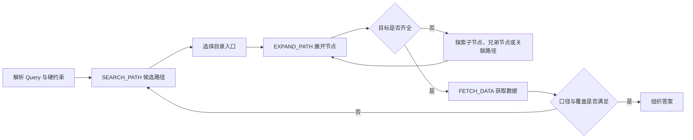
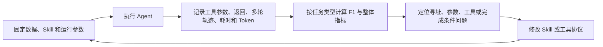

# 第二阶段：让 Agent 沿目录主动寻址，并把方法沉淀成 Skill

> 口径说明：本章数字是项目阶段快照；示例已经重新编写，不对应真实客户或原始业务数据。

## 1. 为什么优化后的检索 Workflow 仍然不够

第一阶段解决了大量高频、单目标问题，但剩余 Badcase 中出现了一类不同的任务：用户不是寻找一个指标，而是要求覆盖多个地区、多个口径或一组相关目标。

例如：

> 查询某城市全部下属地区在指定季度的同一经济指标及其累计同比。

这类问题至少包含三步：先确认下属地区集合，再为每个地区定位相同口径的指标，最后检查结果是否完整。多次改写 Query 可能召回大量重复候选，却没有增加实际地区覆盖。

结合当时 TopK 实验没有明显增益，以及剩余 Case 的覆盖与恢复问题，我得到的工程判断是：

> 长尾取数不只是相关性排序问题，还需要在结构化空间中探索、记住已经覆盖的目标，并在局部失败后换路径继续找。

因此，第二阶段引入目录树寻址 Agent，专门补足需要多步探索的任务。这个选择由候选实验与失败轨迹共同支持，不能仅由三个 TopK 分数推出。

## 2. 目录树给 Agent 增加了什么

原来的检索链路直接从大规模指标集合中返回一批相似候选。目录树方案先把指标组织成层级路径：

```text
宏观主题
└── 地区经济
    └── 某地区
        ├── 子地区 A
        ├── 子地区 B
        └── ……
```

这张简化示意图不代表真实内部目录。实际设计还需要支持跨子树关联，因为同一指标可能存在多个合理入口。

目录结构为模型提供了三类状态：

- 当前已经走到哪条路径；
- 当前节点还有哪些子节点、兄弟节点或关联路径可探索；
- 哪些目标已经找到，哪些仍然缺失。

TopK 是一份无状态候选列表；目录树则是一个可以连续行动的搜索空间。

## 3. `SEARCH_PATH → EXPAND_PATH → FETCH_DATA` 的 Agent 循环

下面三个名称是为了公开说明流程而使用的通用代称，不对应真实接口名或参数 Schema。



| 动作 | 主要输入 | 主要输出 | 作用 |
| --- | --- | --- | --- |
| `SEARCH_PATH` | 主题、地区、指标名等 Query 信息 | 候选目录路径 | 决定从哪里开始找 |
| `EXPAND_PATH` | 已选中的目录路径 | 子节点或关联项 | 看清当前节点下面有什么 |
| `FETCH_DATA` | 已确认指标与查询参数 | 最终数据 | 完成真实取数 |

`SEARCH_PATH` 仍然可以使用语义召回，但召回对象变成了路径入口，而不是要求一步命中最终指标。Agent 根据每次工具返回决定下一步是否继续展开、转向兄弟节点或重新搜索。

因此，Agent 的核心不是一次生成更多 tool call，而是把一次性排序改造成带状态的多轮决策。

## 4. 一个多地区任务如何执行

对于“查询某城市全部下属地区的同一指标”，一条理想轨迹大致是：

```text
1. 从 Query 中提取地区、指标、时间和统计口径。
2. SEARCH_PATH 找到城市及指标相关的候选路径。
3. EXPAND_PATH 展开城市节点，获得下属地区列表。
4. 建立待覆盖集合，并逐个定位相同口径的指标。
5. 某条路径为空时，退回父节点，检查兄弟节点或关联路径。
6. 对已确认且互不依赖的指标批量或并行 FETCH_DATA。
7. 返回前检查地区是否完整，时间与统计口径是否一致。
```

并发不是目标本身。当多个最终指标已经确定、查询之间没有依赖时，可以批量执行；但目录的下一层是什么，需要先看到上一步返回结果。Agent 必须同时处理顺序依赖和可并行的执行段。

## 5. 四类 Badcase 如何变成 Skill 规则

### 5.1 候选重排

**现象：** 多条候选路径名称相近，语义最像的路径却不满足地区层级或统计口径。

**处理：** 在语义相关性之外检查地区、主题、频率和指标类型等硬约束，再对候选入口重排。

### 5.2 空结果 fallback

**现象：** 当前路径或参数返回空结果，Agent 直接把它解释成“没有该指标”。

**处理：** 先检查参数，再退回父节点或其他候选路径，必要时重新搜索。一次为空不代表全局不存在答案；也可能是指定时间确实无数据。回退应有轮数或调用预算，重复动作没有新信息时及时停止，并把未覆盖目标明确标记出来。这里描述的是完成标准与恢复原则，不是声称已测得某个最优预算。

### 5.3 兄弟节点探索

**现象：** Agent 找到部分地区或部分指标后提前结束，遗漏同级目标。

**处理：** 显式维护待覆盖集合。完成一个节点后继续检查兄弟节点，直到全部目标被处理或缺失项被明确标记。

### 5.4 路径与参数约束

**现象：** 找到了正确主题，却因为路径层级、时间、频率或统计口径参数不一致而取错数据。

**处理：** 固定路径使用规则、参数字段与调用顺序，并在最终回答前做口径一致性检查。

这四类修改对应的是整体方案中的关键工程修复。目前没有逐项消融实验，因此不把它们分别写成独立的效果提升。

## 6. Skill 不只是 System Prompt 的 description

我将 Skill 理解为一份可版本化的任务操作规程：它告诉 Agent 什么时候适合使用这套能力、应该按什么顺序调用工具、参数怎样构造、失败后怎样恢复，以及什么状态才算完成。

| Skill 层次 | 解决的问题 |
| --- | --- |
| 适用范围 | 哪类 Query 应该进入这套流程 |
| 工具协议 | 有哪些动作，各自参数与返回是什么 |
| 决策策略 | 正常情况下怎样搜索、展开和取数 |
| 异常恢复 | 空结果、歧义、缺项时怎样回退 |
| 完成标准 | 如何防止只找到部分结果就提前结束 |

它不是数据本身，也不只是工具清单。工具清单告诉模型“能做什么”，Skill 进一步描述“在什么条件下应该怎么做”。

Skill 化以后，同一套任务策略可以独立版本管理，也可以在不同模型与 Agent Runtime 上回放。成功和失败轨迹都能继续进入 Badcase 分析，成为下一轮 Skill 修改或训练数据构造的依据。

## 7. Runtime、Skill、工具和模型如何配合

| 组件 | 职责 |
| --- | --- |
| Agent Runtime（Claude Code SDK / OpenCode） | 维护多轮上下文，执行 tool call，并把工具结果送回模型 |
| Skill | 提供任务策略、参数约束、异常恢复和完成标准 |
| 工具接口 | 执行搜索、目录展开和真实取数 |
| 大模型 | 理解 Query，结合 Skill 与工具返回选择下一步动作 |
| Harness / Scorer | 固定运行配置、记录轨迹并计算评测结果 |

我在实验链路中同时保留了 Claude Code SDK 和 OpenCode 两类 Agent Runtime，用来观察相同模型和 Skill 在不同消息模板、tool call 编排与状态维护方式下的表现。这样可以把“模型能力”与“运行框架差异”分开，而不是只比较一个最终总分。

## 8. 用完整轨迹迭代，而不是只看最终答案



最终答案能判断任务是否完成，完整轨迹才能解释为什么成功或失败。它还让局部修复能够做全量回归，避免某条 Badcase 修好后破坏其他类型的任务。

这套 Harness 与 Scorer 后来也成为训练阶段的统一验收入口：模型无论经过监督微调、在线策略蒸馏还是强化学习，都要回到同一批任务和同一套 Skill 中比较，而不能只看训练 loss。

## 9. 阶段结果与下一步问题

早期单项能力迭代记录中：

| 方案 | F1 |
| --- | ---: |
| 快速检索参考方案 | 71.31 |
| 目录树 Agent | 91.68 |
| 提升 | +20.37 |

这组数字说明目录树寻址与 Skill 迭代对当时的长尾任务有效，但它只属于早期单项评测，不能与后续多 Skill 评测中的数字直接拼成连续曲线。

第二阶段也暴露了新的现实约束：依赖高能力外部模型可以验证方案上限并产生高质量轨迹，但成本、延迟和并发承载不适合所有请求。下一阶段的目标因此变成：把已经验证有效的 Agent 行为转化为训练数据，再将能力内化到更小、更快的专用模型中。

## 10. 这一阶段留下的方法论

1. 当候选深度实验没有明显收益，而失败集中于漏覆盖与恢复时，可以引入有状态探索，并继续保留快速检索处理适合的任务。
2. Agent 效果由搜索空间、工具粒度、异常恢复和完成条件共同决定。
3. Skill 把一次成功提示变成可版本化、可回放、可评测的操作规程。
4. 空结果和局部成功必须成为显式状态，否则模型很容易提前结束。
5. 最终答案用于验收，完整轨迹用于归因和继续训练。

---

[返回首页](../README.md) · [项目地图](00-project-map.md) · [实验与数据口径](06-experiment-index.md)
