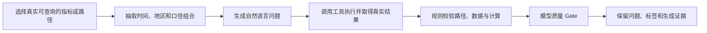
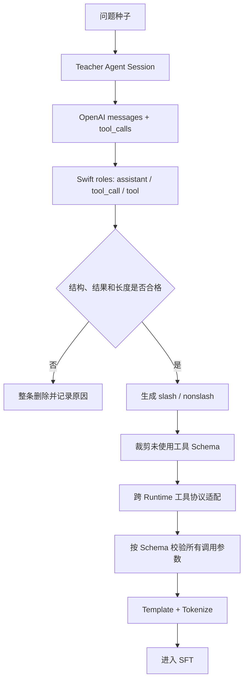

# 第三阶段（上）：从问题种子到可训练 Agent 轨迹

> 口径说明：本章保留通用处理逻辑和重新编写的示例，不提供原始数据、真实工具 Schema、内部 Prompt、服务地址或可还原的业务样本。

## 1. 为什么“有 QA”不等于“有 SFT 数据”

项目进入模型训练阶段后，我最先需要纠正的认识是：一条问题和一个参考答案，并不能直接教会模型怎样使用 Skill。

金融 Agent 真正要学习的是完整行为链：

```text
问题 / QA 种子
    ↓
Teacher Agent 真实运行
    ↓
选择 Skill → 调用工具 → 读取结果 → 失败恢复 → 最终回答
    ↓
结构化、过滤和协议转换
    ↓
模型可以训练的多轮轨迹
```

如果只用 `question → answer` 训练，模型可能会学会回答口吻，却学不会以下能力：

- 什么时候应该调用哪个 Skill；
- 工具参数应该怎样构造；
- 多个独立指标怎样组织成并行调用；
- 工具返回为空或报错后怎样恢复；
- 什么时候已经取得足够证据，可以停止调用并回答。

所以数据工程的核心不是把 JSON 换一种格式，而是把一次真实 Agent 执行保存成可复现、可过滤、可监督的行为样本。

## 2. 上游问题从哪里来

上游任务种子主要来自三类来源：

| 来源 | 优点 | 主要风险 |
| --- | --- | --- |
| 人工标注 QA | 业务目标清楚、答案相对可靠 | 数量有限，标注成本高 |
| 线上问题 | 表达真实，能覆盖自然长尾 | 可能缺少答案，存在噪声和时间漂移 |
| 合成 QA | 可以定向补充稀缺口径和组合任务 | 容易产生不可执行问题或错误标签 |

项目材料中的建设口径约为 6,400 条多 Skill SFT 数据，其中结构化数据任务约 3,000 条、指标检索任务约 2,000 条，其余任务类型用于补足新闻、公告、研报、专题报表、实时查询等能力。

这里的“6,400 条”是项目建设口径，不应与某次训练脚本展开后的源轨迹行数混为一谈。同一个业务问题可能存在不同 Teacher、不同 Runtime、slash/nonslash 两种上下文版本，因此训练行数不等于唯一 Query 数。

## 3. 合成 QA 不是让大模型自由编一道题

复杂指标问题的长尾组合很多，只靠人工很难覆盖。我参与的数据合成思路是从真实可查询的数据反向构造问题，并用执行结果约束答案。



我把合成质量拆成三层：

1. **路径真实**：问题要求的指标在工具空间中确实存在，不能只在文字上合理。
2. **数据真实**：指定时间范围能够返回有效数据，不把空结果包装成标准答案。
3. **计算正确**：如果问题要求求和、排序或同比比较，答案必须能由取回的数据重新计算得到。

项目阶段记录中，约 10,000 条候选经过执行校验和双质量 Gate 后得到 4,251 条可训练 QA，并识别、修正了约 19% 的标签不一致。这里的 Gate 是整体质量控制口径；现有公开材料不足以支持逐个 Gate 的精确淘汰归因，因此不把 10,000 到 4,251 的差额拆成未经验证的细项。

一个重新编写的例子：

```text
候选指标：某城市三个下属地区的工业用电量
时间范围：2022—2024 年
计算任务：比较三年累计值并找出最高地区

生成问题：
“2022—2024 年，某城市下属三个地区中，哪个地区工业用电量累计最高？”

校验：
1. 三个地区路径都存在；
2. 每个地区三年数据都能取回；
3. 用工具结果重新求和；
4. 计算结果与生成标签一致；
5. 问题没有泄露指标 ID 或答案。
```

这一步产出的仍然只是可执行 QA。要成为 SFT 数据，还需要让 Teacher Agent 真正完成一次任务，产生 Skill 和工具轨迹。

## 4. Step 0：让 Teacher Agent 真实执行

每个 Query 启动一次独立 Agent Session。Session 中保存的不只是对话文本，还包括：

- System 上下文和可用工具；
- 原始问题；
- Teacher 的推理片段；
- Skill 选择与工具参数；
- 工具返回、错误信息和重试；
- 最终回答；
- Teacher、Session 和轮数等元数据。

下面用一条完全重新编写的指标查询展示事件顺序：

```text
问题：2021 年某国女性平均初婚年龄是多少？

1. Teacher 选择“指标检索” Skill。
2. 第一次 SEARCH 的路径参数不合法，工具报错。
3. Teacher 根据错误信息修正路径，再次 SEARCH。
4. SEARCH 返回候选指标。
5. Teacher FETCH 指定年份的数据。
6. 工具返回数值。
7. Teacher 组织最终回答。
```

如果 Teacher 第一次失败、随后成功恢复，这条纠错轨迹可能比“一步成功”更有训练价值。但如果 Teacher 连续循环报错或最终没有答案，格式转换本身不会把坏轨迹修好，必须在后续过滤阶段删除。

## 5. Step 1：Session 整理为 OpenAI 风格

原始 Session 可能由多种事件组成。第一步以 Session 为边界，把它聚合成一行 JSONL：

```json
{
  "messages": [
    {"role": "user", "content": "2021 年某国女性平均初婚年龄是多少？"},
    {
      "role": "assistant",
      "reasoning_content": "先搜索对应指标，再取指定年份。",
      "tool_calls": [
        {
          "id": "call_001",
          "type": "function",
          "function": {
            "name": "SearchIndicator",
            "arguments": "{\"query\":\"女性平均初婚年龄\"}"
          }
        }
      ]
    },
    {
      "role": "tool",
      "tool_call_id": "call_001",
      "content": "[{\"indicator\":\"candidate_A\"}]"
    },
    {"role": "assistant", "content": "……最终回答……"}
  ],
  "tools": ["公开示例中省略真实 Schema"],
  "metadata": {"teacher": "teacher-model", "session_id": "example-session"}
}
```

这一步只做聚合与协议统一：它不会重新生成 reasoning，也不会改变 Teacher 当时的工具顺序。

## 6. Step 2：OpenAI 消息转成 Swift Agent 消息

OpenAI 风格把 `tool_calls[]` 内嵌在 assistant 消息中；训练管线需要把它拆成显式角色：

```text
OpenAI：
assistant(reasoning_content, tool_calls=[A, B])
tool(result_A)
tool(result_B)

转换后：
assistant(<think>原 reasoning</think>)
tool_call(A)
tool_call(B)
tool(result_A)
tool(result_B)
```

主要转换规则包括：

- `reasoning_content` 包进 `<think>...</think>`；
- `assistant.tool_calls[]` 拆成独立的 `role=tool_call`；
- 工具返回统一成 `role=tool`；
- 工具名称和参数序列化为稳定 JSON；
- 校验合法角色与基本消息顺序。

这里有一个重要边界：**MS-Swift 没有理解 thinking 后重新决定并行。**

如果原始 Teacher 的同一个 assistant turn 已经产生三个 `tool_calls`，转换后会出现三条连续 `tool_call`。模板化时，这个连续区间再被还原成同一个 assistant 的结构化调用块。

```text
原始 assistant.tool_calls 数组长度 = 并行调用组的长度
```

如果原始轨迹把三个指标分成三轮调用，数据转换不会仅凭 thinking 里写了“同时查三个指标”就把它们合成并行组。

## 7. Step 3：过滤的是整条轨迹

过滤规则并不是“看起来不好就删”，而是针对 Agent 轨迹的完整性：

| 检查 | 代表性规则 | 原因 |
| --- | --- | --- |
| 结尾完整 | 最后一条必须是 assistant | 轨迹不能停在调用或工具返回 |
| 最终回答有效 | 去掉 think 后仍应有正文，且不含明确失败结论 | 失败不能当标准示范 |
| 调用闭合 | tool call 数不能大于 tool result 数 | 避免存在没有返回的调用 |
| 确实使用工具 | 至少有一次 tool call | 这批数据训练的是 Agent 行为 |
| 循环受控 | 总调用次数不能异常过多 | 删除失控循环和低效轨迹 |
| 连续失败 | 多次连续调用都返回错误时删除 | 防止模型学习无效重试 |
| 长度 | 按目标模型 template 和 tokenizer 计数 | 字符数不能代表真实训练长度 |

一条轨迹通常是整行保留或整行删除。例如：

```text
第一次工具调用报错
→ 第二次修正参数成功
→ 最终回答正确
```

这条轨迹可以整体保留，以便模型学习恢复策略。管线不会只删除第一次失败的三条消息，否则后续修正就失去了因果上下文。

超长数据还要经过两道门：离线过滤门槛和训练脚本的 `max_length`。如果两处使用的模型、template 或 thinking 模式不同，同一条样本可能在离线统计中合格，却在训练预处理时被删除。因此，生产数据管线最好把每条样本的 token 长度和 `drop_reason` 单独记录。

## 8. Step 4：slash 与 nonslash 是两种行为上下文

同一条成功轨迹可以生成两种训练版本。

### slash 版本

```text
用户：/financial-indicator 查询……
上下文已经加载对应 Skill
Agent 继续执行工具轨迹
```

它主要训练“用户显式指定 Skill 后怎样完成任务”。

### nonslash 版本

```text
System reminder：
- financial-indicator：用于宏观和行业指标查询
- financial-news：用于新闻检索
- ...

用户：查询……
assistant 调用 Skill(name="financial-indicator")
tool 返回完整 Skill 内容
Agent 再执行后续工具轨迹
```

nonslash 的 System 上下文放的是可用 Skill 的名称与简短 description，不是把所有 Skill 正文一次性塞进去。模型先根据 description 选择 Skill；真正的 Skill 操作规程在调用后由工具返回。

这两种版本训练的是不同能力：

- slash：已知 Skill 后的执行能力；
- nonslash：从自然语言问题到 Skill 路由，再到执行的完整能力。

## 9. 随机裁剪的是未使用工具 Schema，不是历史调用

每条样本包含两个不同对象：

```text
messages：Teacher 实际做过什么
tools：   当时允许调用哪些工具的说明书
```

管线会以固定随机种子，对每个未使用工具的 Schema 做概率裁剪；真实使用过的工具和 `Skill` 工具必须保留。

```python
used_tools = collect_tool_names(messages)

for schema in tools:
    if schema.name == "Skill" or schema.name in used_tools:
        keep(schema)
    elif random() < 0.5:
        drop(schema)
```

这样做有两个目的：

1. 减少完全无关工具 Schema 占用长上下文；
2. 防止模型依赖“每条样本永远出现同一份工具菜单”的偶然模式。

它不会删除已经发生的 tool call，也不会改变轨迹答案。协议转换导致某个工具没有对应实现，与这里的随机裁剪也应分开统计。

## 10. Step 5：跨 Runtime 协议适配

Teacher 轨迹可能来自不同 Agent Runtime。它们在工具名、参数命名和 Skill 返回包装上并不完全一致，例如：

| Runtime A | Runtime B |
| --- | --- |
| `Bash` | `bash` |
| `file_path` | `filePath` |
| `Skill.arguments.skill` | `skill.arguments.name` |
| 两段 Skill 返回 | 单个 `<skill_content>` 包装 |

协议适配需要同时修改：

- 顶层工具 Schema；
- 每一次 tool call 的名称和参数；
- 与之对应的 tool result 包装；
- System 中的 Skill 列表；
- 不存在一对一映射时的删除或降级策略。

这不是简单的字符串替换。只改工具名、不改参数 Schema，会让样本在训练时看起来正常，推理时却无法被 Runtime 真正执行。

## 11. Step 6：按当前工具 Schema 校验参数

最终每个 tool call 都要在对应工具 Schema 下验证：

```text
工具名是否存在
必填字段是否齐全
字段类型是否正确
枚举值是否合法
是否出现不允许的额外字段
```

通过后才写入最终训练文件。文件名可以记录 Teacher、任务域、协议版本、slash/nonslash、过滤版本和参数校验状态，形成最基础的数据血缘。

但文件名不能替代审计记录。为了真正复现，我还需要保存：

- 输入文件列表与 hash；
- 每一步脚本版本；
- 每条样本保留或删除的原因；
- 使用的 tokenizer、template 和最大长度；
- 实际加载的文件数、样本数和最终 resolved 配置。

## 12. 从 Session 到训练行的完整 Case



这一流程让我认识到，Agent 数据质量至少包含四层：

1. **任务正确**：问题和标签本身成立；
2. **行为正确**：Teacher 使用了合理的 Skill 与工具路径；
3. **结构正确**：调用、返回和角色边界闭合；
4. **协议正确**：训练模板与实际 Runtime 能够一致解析。

任何一层出错，都可能让模型学到“格式像 Agent、实际不能执行”的轨迹。

## 13. 这一部分留下的方法论

1. 问题种子、参考答案、Teacher Session 和最终训练行是四种不同资产。
2. 数据转换应保留原始行为，不应根据 thinking 猜测并重新编排工具调用。
3. 可恢复失败可以保留；不闭合、最终失败和失控循环应该整条删除。
4. slash/nonslash 的区别是 Skill 上下文和路由方式，不是答案内容不同。
5. 只裁剪未使用工具 Schema，不能裁掉真实发生过的调用。
6. 数据构建必须保存 resolved 配置、drop reason 和 hash，不能只相信 Shell 文件名。
