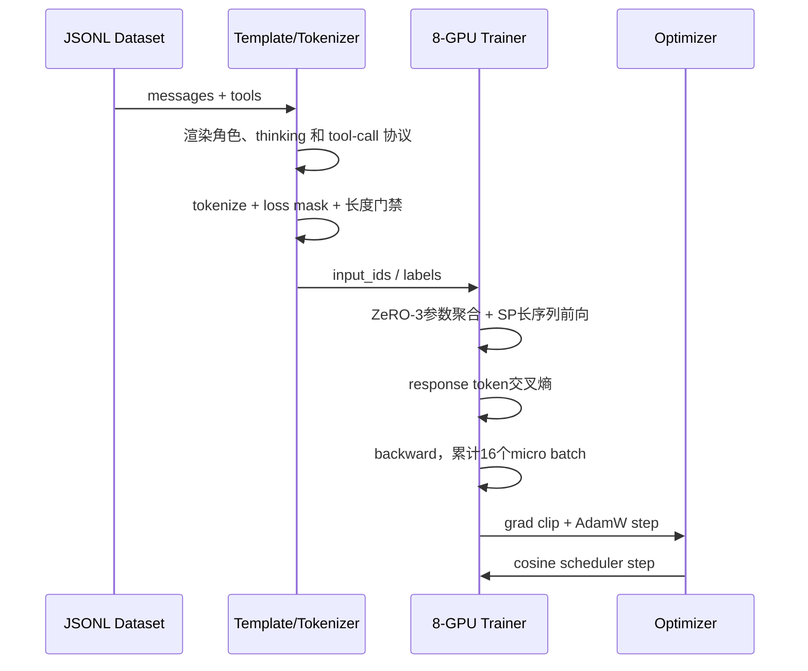
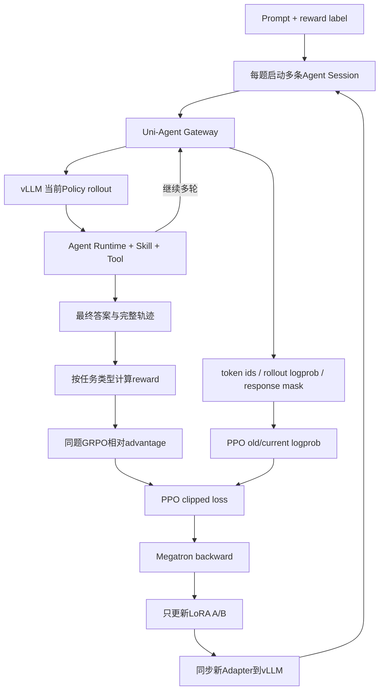
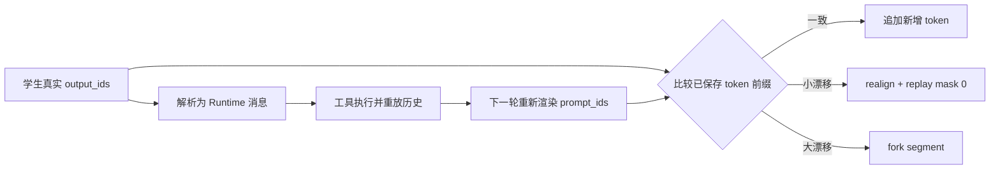
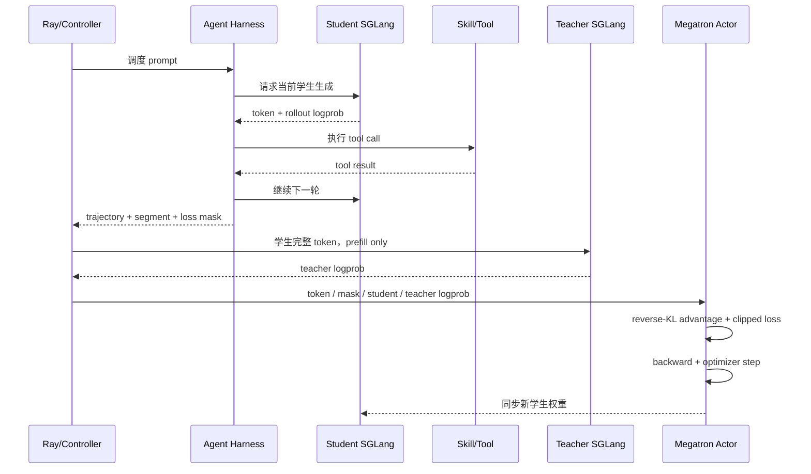

# 第三阶段（中）：SFT 冷启动、任务 RL 与在线策略蒸馏

> 本章按 SFT → RL → OPD 的顺序解释训练思路。示例为合成；各实验使用的模型和配置分别列在第 5 节，不代表同一个 checkpoint 连续经过三轮训练。

第三章解决了“怎样把任务和 Teacher 的执行过程变成训练数据”。接下来，我完成了全参数 SFT、Agent RL 和在线策略蒸馏（OPD）训练，以及相应的数据、协议和训推适配。目标是让专用模型学会使用 Skill，在真实工具反馈下完成任务。

## 1. 三步分别在解决什么

| 训练方式 | 模型做什么 | 训练反馈来自哪里 | 要解决的问题 |
| --- | --- | --- | --- |
| SFT | 学习 Teacher 已经完成的轨迹 | 示范中下一步应生成的 token | 先学会选 Skill、发出合法调用、读结果并回答 |
| 任务 RL | 对同一道题独立执行多次 | 每次实际执行的任务 reward | 在自己的尝试中提高完整取数、正确选指标的概率 |
| OPD | 当前学生自己执行，教师为学生输出打分 | 教师对学生实际生成 token 的概率 | 在学生遇到的上下文中，提供比整条任务分数更细的反馈 |

SFT 的限制是数据固定：学生上线后可能走进示范没有覆盖的状态。RL 让模型在自己的轨迹上学习，但一条轨迹的任务分数不能直接指出哪一步该改；同题多次尝试全部同分时，相对学习信号也很弱。OPD 则引入教师的逐 token 反馈，提供另一种在线学习信号。

下面沿用第二章的任务：**比较某市居民三个阶梯、非居民、特种行业共五项供水单价，均不含污水处理费。** 同一道示意题用来说明监督方式的变化，不用于证明三个实验的连续收益。

## 2. SFT：先让模型学会把任务跑起来

Teacher 已经留下了一条完整示范：

```text
列出五项目标，选择对应 Skill
→ 搜索居民阶梯、非居民、特种行业
→ 确认四项，发现还缺特种行业
→ 用已命中指标的父节点补找，排除污水处理费
→ 取回五项数据，核对时间、单位并回答
```

我把第三章处理好的消息交给训练模板，将角色、工具说明、调用和返回转成模型的 token 序列。模型在每个历史上下文中学习 Teacher 接下来生成什么，例如看到“四项已找到、一项缺失”后，生成补找命令。

**训练时不重新调用工具，工具返回已经保存在示范里。** 问题、Skill 内容和工具结果作为上下文；assistant 的调用与回答计算监督 loss，非空 thinking 是否训练取决于模板和 mask。工具返回本身不作为要模型生成的答案来训练。

这一阶段的具体工作是数据加载、模板与监督位置适配，以及长轨迹的全参数训练。代表性 MoE 实验采用 8 卡、ZeRO-3 和序列并行，解决完整模型训练状态与长上下文的显存开销。

SFT 给模型一个能开始执行任务的基础，但 loss 下降不等于取数正确。假如学生自己搜索时遇到了不同候选、空结果或错误参数，它后续面对的上下文就偏离了固定示范。下一步需要让模型亲自执行，并根据自己的执行结果学习。

<details>
<summary>SFT 细节：模板、loss mask、长上下文配置和一次训练 step</summary>

### 2.1 SFT：模型到底看到了什么

#### 2.1.1 Template 是模型与 Runtime 的文本协议

训练 JSONL 还不是模型最终看到的 token。Template 会把以下内容拼成一个序列：

```text
System
可用工具 Schema
User Query
Assistant thinking
Assistant tool call
Tool result
Assistant 下一轮 thinking / tool call
...
Assistant final answer
```

对 Qwen Agent 模板，一个简化片段可能是：

```text
<|im_start|>system
You are an assistant.
# Tools
...function schemas...
<|im_end|>

<|im_start|>user
查询三个地区的同一经济指标。
<|im_end|>

<|im_start|>assistant
<think>三个指标彼此独立，可以在同一轮查询。</think>
<tool_call>...</tool_call>
<tool_call>...</tool_call>
<tool_call>...</tool_call>
<|im_end|>

<|im_start|>tool
...结果 A...
<|im_end|>
```

同一个 assistant turn 中出现几个 `<tool_call>`，取决于原始轨迹该 turn 中有几个结构化调用。MS-Swift 的模板负责渲染现有分组，不会读懂 think 后自动把三轮调用改成一轮并行。

#### 2.1.2 哪些 token 计算 SFT loss

系统说明、用户问题和工具返回是条件；模型自己生成的 thinking、tool call 和最终回答才是主要监督目标：

```text
system / user / tool result     labels = -100，loss_mask=0
assistant think / call / answer labels = token_id，loss_mask=1
```

SFT 交叉熵为：

$$
L_{SFT}=-\frac{1}{N}\sum_{t=1}^{N}\log P_\theta(y_t\mid x,y_{<t})
$$

代表性脚本使用 `loss_scale=ignore_empty_think`。它只忽略空的 thinking 区域，不代表删除所有 think，也不会改写 Teacher 的 think 内容。非空 thinking 是否训练，仍由样本与模板的 loss mask 决定。

#### 2.1.3 Thinking 模式必须成套记录

`enable_thinking`、是否补空 think 前缀、chat template 和部署时的 reasoning parser 共同决定 token 形式。训练时看过：

```text
<think>...</think><tool_call>...</tool_call>
```

部署却按另一套 JSON 或无 think 协议解析，即使模型生成了训练时正确的 token，Runtime 也可能把它当普通文本，工具不会执行。

所以实验记录不能只写“某模型 checkpoint”，还要写：

- tokenizer 版本；
- chat/agent template；
- thinking 开关；
- tool-call parser；
- stop token；
- Runtime 及其消息协议。

### 2.2 长上下文全参数 SFT 的代表性配置

| 参数 | 代表性值 | 作用 |
| --- | ---: | --- |
| GPU 进程 | 8 | 每卡一个训练进程 |
| tuner | full | 更新全部可训练参数 |
| dtype | BF16 | 降低显存，同时保持较大指数范围 |
| epoch | 2 | 完整遍历数据两次 |
| learning rate | `5e-6` | 全参数微调使用较小步长 |
| scheduler | cosine + 5% warmup | 初期稳定、后期逐步衰减 |
| micro batch | 1 / GPU | 受超长序列显存限制 |
| gradient accumulation | 16 | 累积多个 micro batch 后更新 |
| max length | 102,400 token | 覆盖长工具轨迹 |
| overlength | delete | 整条删除，避免截断调用与返回 |
| sequence parallel | 4 | 一条长序列的相关计算拆到 4 卡 |
| DeepSpeed | ZeRO-3 | 参数、梯度和优化器状态分片 |
| attention | FlashAttention | 降低长序列 attention 内存与计算开销 |
| padding | padding-free | 避免无效 padding token 计算 |
| gradient checkpointing | 开启 | 反向时重算部分前向，节省 activation |

8 卡、SP=4 时，数据并行度近似为：

$$
DP=8/4=2
$$

有效全局序列 batch 近似为：

$$
1\;(micro)\times16\;(accumulation)\times2\;(DP)=32
$$

它是序列数，不是固定 token 数。Agent 轨迹长短差异很大，每个 optimizer step 的实际 token 量仍会变化。

### 2.3 为什么高显存 GPU 训练 MoE 仍然需要 ZeRO-3

模型名中的 “A3” 只表示每个 token 参与计算的激活参数约为 3B，不表示训练时只需保存 3B 参数。

训练时必须容纳完整模型，并为可训练参数保存梯度和优化器状态。主要开销包括：

```text
BF16 模型权重
+ 梯度
+ Adam 一阶矩
+ Adam 二阶矩
+ 可能存在的 FP32 master state
+ 102.4k 序列的 activation
+ attention、通信和临时 buffer
```

只算 BF16 权重，35B 级参数已经约为 70GB（十进制估算）。加入梯度和 Adam 状态后，静态训练状态会达到数百 GB；102.4k 长上下文的 activation 又是另一块巨大开销。

两种并行解决的是不同问题：

| 技术 | 主要分什么 | 解决的显存 |
| --- | --- | --- |
| ZeRO-3 | 参数、梯度、优化器状态 | 静态模型训练状态 |
| Sequence Parallel | 长序列相关 activation 与计算 | 超长上下文中间激活 |

因此，即使单卡显存很大，MoE 每 token 只激活少量专家，也不能替代 ZeRO-3。MoE 节省的是每 token 计算量，不会自动删掉未激活专家的权重和优化器状态。

### 2.4 一次 SFT step 怎样发生



训练 loss 或 token accuracy 只能说明模型对标准 token 的拟合程度。它不能替代 Agent 评测：模型可能正确生成 XML，却选错 Skill；也可能调用格式合法，却漏掉业务所需指标。

</details>

## 3. RL：让模型自己尝试，用任务结果比较好坏

RL 阶段输入的是问题和评分所需标签。模型只收到任务与可用工具，标签留给 reward 程序；没有预先规定的标准工具轨迹。当前策略对每道题生成多条独立的 Agent 会话，真实执行搜索、目录补找和取数。

以水价任务为例，假设评分只比较最终成功取回的指标集合与五项目标集合，三次尝试可能是：

| 尝试 | 执行结果 | 集合 F1（示意） |
| --- | --- | ---: |
| A | 正确取回四项，漏掉特种行业 | 0.89 |
| B | 正确取回五项，没有额外指标 | 1.00 |
| C | 正确取回五项，又多取一项污水处理费 | 0.91 |

这时训练可以鼓励 B 对应的行为，抑制相对较差的尝试。**这些分数是指定评分口径下的演示，不是历史 reward 回放；实际 reward 统计什么，必须核对当前解析器和标签。** 其他 Skill 的完成标准不同，表格取数需要对齐单元格，文档定位要检查文档命中，不能全部套用指标集合 F1。

一次更新的过程是：

```text
同一道题采样多条完整会话
→ 执行工具，收集轨迹和实际结果
→ 按任务类型计算 reward
→ GRPO 比较同题各次得分，得到相对 advantage
→ PPO-clip 在模型生成位置更新策略
→ 将新权重同步回推理引擎，继续采样
```

这里的 advantage 可以理解为“这次比同题其他尝试好多少”。它来自组内比较，不是分数高于某条固定及格线就一定为正。代表性 MoE 实验冻结基座，只更新 LoRA 参数；LoRA 决定更新哪些参数，RL 决定用什么反馈学习，两者不是同一概念。

我完成的工作包括多 Skill reward 接入、在线 Agent 轨迹与 token/mask 收集、GRPO/PPO 训练配置、MoE 训推路由对齐和 Adapter 同步。Reward 还必须与工具返回协议一起检查：如果解析器漏读字段，实际成功的取数也可能得不到应有分数。

**引入 OPD 的动机在于反馈粒度。** 任务 reward 能比较完成度，但通常给整条会话一个分数。如果八次都漏掉同一项，组内没有差异，就很难靠相对比较学到补找；即使分数不同，也没有直接标明错误发生在哪个 token。OPD 从教师取得逐 token 的概率反馈，针对的是这种监督粒度问题。它仍需独立评测，不能据此断言一定优于任务 RL。

<details>
<summary>RL 细节：数据与 reward、GRPO/PPO、LoRA、MoE 路由对齐和并行配置</summary>

### 3.1 Agent RL：题库里为什么没有标准工具轨迹

RL 数据只需要提供：

```json
{
  "prompt": [{"role": "user", "content": "重新编写的金融任务"}],
  "data_source": "indicator_task",
  "reward_model": {"style": "rule"},
  "extra_info": {
    "metadata_json": "{...}",
    "label_json": "{...reward 所需标签...}"
  }
}
```

标签不作为 assistant 标准答案喂给模型。它只在 rollout 完成后供 reward 代码判断任务是否完成。

异构标签先序列化成 JSON 字符串，是为了保持 Parquet 顶层 Schema 稳定：指标任务可能是目标指标集合，表格任务可能是期望单元格，报告任务可能是文档代码。Reward 阶段再按 `data_source` 反序列化。

工具选择、调用数量、并行结构和失败恢复全部由当前 policy 在线生成。

### 3.2 RL 的完整闭环



系统组件的职责：

| 组件 | 职责 |
| --- | --- |
| verl Trainer | 采样调度、batch、advantage、loss 与训练流程 |
| vLLM Rollout | 使用当前 Base + LoRA 高并发生成 |
| Uni-Agent Gateway | 连接模型与 Agent，保存 token、logprob、mask 等训练真值 |
| Agent Runtime | 驱动多轮 Session、Skill 与工具执行 |
| Reward | 根据轨迹和标签计算任务完成质量 |
| Megatron | 分布式前向、反向与 LoRA 参数更新 |

### 3.3 Reward 为什么必须按任务类型设计

不同 Skill 的“正确”并不是一种形态：

| 任务类型 | 代表性 reward |
| --- | --- |
| 指标检索 | 实际查询指标集合与目标集合的 Precision / Recall / F1 |
| 表格取数 | 列名、日期、单位和单元格对齐后的 Table F1 |
| 报表定位 | 目标文档代码的 Hit@1 / Hit@5 |
| 新闻检索 | 文档 ID、标题、URL 与要点覆盖 |
| 公告、研报、企业查询 | 多次 LLM-as-a-Judge 后聚合 |

以指标检索为例：

```text
TP = 查到且属于标签的指标
FP = 查了但标签不需要的指标
FN = 标签需要但没有查到的指标

Precision = TP / (TP + FP)
Recall    = TP / (TP + FN)
Reward    = F1
```

这样既惩罚漏查，也惩罚为了碰运气而大量查询无关指标。只对最终回答文字做 Judge，可能看不到 Agent 实际调用了错误指标。

#### 3.3.1 指标集合 reward 与业务正确性并不总是等价

第一章中，完整月度值可能足以计算季度总量；如果 reward 严格匹配标签中的季度指标 ID，这条替代路径可能被记为漏查季度指标、又多查月度指标。对于“定位指定指标集合”的任务，这种约束可以合理；对于“给出可计算的业务答案”的任务，它可能只是有偏的代理目标。

因此需要明确评分对象：计入集合的是搜索候选、发出的取数请求，还是成功返回有效数据的指标？是否接受口径一致、可计算的替代指标？探索动作与最终答案如何分别计分？当前公开示例没有给出完整等价规则，不能宣称 Set F1 已覆盖所有业务正确路径。

回归 reward 时，可以使用 [项目地图中的合成 Case](00-project-map.md)，分别检查直接季度取数和月度求和路径。若业务定义接受两者，就应通过可验证的等价映射或计算校验处理；这属于评分设计要求，不代表历史版本已经实现。

#### 3.3.2 Reward 还要跟工具输出协议一起回归

即使 F1 公式正确，parser 读不到当前工具返回中的指标字段，也会使有效调用无法计分。检查时应先验证工具返回能否解析、提取了多少目标、标签是否非空，再计算 reward。字段缺失和真实空集合应有不同状态，不能都静默当作 0。

训练 reward 与离线 scorer 也可能使用不同目标或聚合方式。版本变化后，用固定合成 Case 对比期望集合、解析结果与最终分数，才知道分歧来自模型行为还是评分协议。

### 3.4 GRPO：同一道题的多次尝试怎样互相比较

代表性实验对每道题启动 8 个独立 Agent Session。设它们的任务 reward 为 `r_1...r_8`：

$$
A_i=\frac{r_i-mean(r_1...r_8)}{std(r_1...r_8)+\epsilon}
$$

关键点是：reward=0.5 不一定得到正 advantage。如果同题其他尝试平均为 0.8，这条轨迹仍然相对较差；如果其他尝试平均为 0.2，它就是正向样本。

如果 8 条轨迹全部同分，组内标准差接近 0，几乎没有相对学习信号。动态难度筛选的意义正是把预算集中到“模型有时能做对、但还不稳定”的题，而不是全对或全错的题。

一条 Session 还可能物化成多个 trajectory segment。实现中应只用每个 Session 的最终段参与 8 次独立 reward 的组内统计，再把该 Session 的 advantage 广播给较早段，避免“物化段更多的 Session”被错误当成更多次独立 rollout。

### 3.5 Response mask：工具返回很长，但不应该被训练

在线轨迹中的 response 区域可能包含：

```text
assistant tool call           mask=1
工具返回的大段数据              mask=0
环境注入的角色标记与模板胶水      mask=0
assistant 分析和最终回答         mask=1
```

一个 20k token 的物化轨迹，真正参与 policy loss 的模型 token 可能只有几百个。工具结果必须进入上下文，因为后续决策依赖它；但不能让模型学习复述环境自动插入的数据。

标量 reward 通常放在最后一个有效 response token 上，再由 GRPO 得到的序列级 advantage 广播到所有 `response_mask=1` 的 token。

### 3.6 PPO-clip 怎样更新 LoRA

GRPO 产生 advantage 后，Actor 计算：

$$
ratio_t=\exp(\log P_{current}(y_t)-\log P_{old}(y_t))
$$

并在有效模型 token 上使用非对称 clip，例如 `[0.8, 1.28]`。正 advantage 提高动作概率，负 advantage 降低动作概率；clip 限制一次更新过大。

LoRA 不直接改冻结权重 `W`：

$$
W_{effective}=W+\frac{\alpha}{r}BA
$$

代表性配置：

```text
rank    = 16
alpha   = 32
dropout = 0
scale   = alpha / rank = 2
```

LoRA 覆盖 attention 和大量 MoE 专家投影。即使 rank 只有 16，只要层数、专家数和目标矩阵很多，Adapter 仍可能达到数十亿参数和数 GB；“用了 LoRA”不等于权重文件一定很小。

### 3.7 MoE 训练中的 R3 Router Replay

同一个 token 在 vLLM rollout 与 Megatron Actor 中，如果被 Router 分到不同专家，那么 current/old logprob 差异中会混入“计算路径不同”的误差。PPO 可能把它误认为策略参数变化。

R3 的处理：

```text
vLLM rollout
→ 保存每层、每个 token 的 Top-K routed experts
→ routed experts 随 trajectory 进入训练 batch
→ Megatron 前向重放 rollout 时的专家选择
→ 在尽量相同的计算路径上比较 logprob
```

重放不能只覆盖最后的回答 token。回答 logits 依赖前面的 Prompt、历史回答和工具上下文形成的 hidden state，因此影响因果前缀的路由也需要对齐。

R3 解决的是“两个推理/训练引擎选了不同专家”。另一类 IS/RS 实验处理的是“rollout policy 与 current policy 已经相差太远”：前者重放路由，后者估计概率比并裁掉过度 off-policy 的 token 或序列。两者不能混为同一个算法开关。

### 3.8 两节点 MoE LoRA RL 的代表性并行

| 并行维度 | 代表性值 | 切分对象 |
| --- | ---: | --- |
| TP | 1 | 本轮不再切单个 Dense 矩阵 |
| PP | 2 | Transformer 层分成两个流水段 |
| EP | 8 | MoE 专家分散到 8 个 Expert Rank |
| CP | 8 | 96k 上下文沿序列维度切到 8 卡 |
| rollout TP | 4 | vLLM 推理权重切到 4 卡 |

对于 96k 上下文：

$$
96,000 / CP8 = 12,000\;token/context\;rank
$$

16 张 GPU 主要用于容纳 PP、EP、CP 组合后的大 MoE 和长上下文，而不是简单复制出大量数据并行副本。训练与 rollout 分阶段复用资源，并使用参数、梯度、优化器 offload 以及 FP8 KV cache 控制显存。

### 3.9 RL 代表性配置与证据边界

| 参数 | 代表性值 |
| --- | ---: |
| Prompt batch | 8 |
| Session / prompt | 8 |
| Epoch | 5 |
| LoRA learning rate | `1e-5` |
| Temperature / top-p / top-k | `1 / 1 / -1` |
| Max Agent turns | 30 |
| Max context | 96k |
| vLLM KV cache | FP8 |
| PPO clip low/high | `0.20 / 0.28` |
| Save / eval interval | 10 step |

不同实验变体还同时改变了数据配方、学习率、长度、micro batch、R3 与 IS/RS 设置。因此，不能只看两条训练曲线就把差异全部归因于某一个机制。要证明 R3、IS 或 rejection sampling 的独立收益，需要单变量消融。

</details>

## 4. OPD：学生自己走，教师给学生实际生成的 token 打分

OPD（On-Policy Distillation）也让当前学生真实执行任务。与任务 RL 相比，主要变化是训练反馈：从“这次任务拿了多少分”，变成“在这个历史上下文中，教师给学生生成的 token 多大概率”。

仍以已经找到四项水价、缺一项为例。学生可能继续搜索，也可能沿父节点补找，甚至提前回答。Teacher 不接管工具执行，也不重新提供一条标准轨迹，而是对学生实际走过的输出进行概率计算：

```text
当前学生执行完整 Agent 任务，保存真实 token 和生成位置
→ 将学生的 token 序列送给 Teacher
→ Teacher 只做前向计算，返回这些 token 的 log probability
→ 在相同前缀、相同 token 上比较学生与教师概率
→ 构造逐 token 的 advantage，更新学生
→ 同步新学生权重，再执行下一批任务
```

在代表性的纯 OPD 配置里，如果教师比学生更认可某个已生成 token，它得到正向 advantage；反之则为负。随后通过 clipped policy update 更新学生。**这是概率反馈，不是教师逐条写自然语言评语，也不等于教师准确定位了业务错误。** 教师偏好的行为仍然要接受真实任务评测。

和 SFT 的区别也在这里：SFT 模仿固定 Teacher 轨迹；OPD 的上下文和动作来自当前学生，教师在这些实际遇到的状态上提供反馈。纯 OPD 实验的业务 reward 固定为 0，学习信号来自教师与学生的概率差，不表示“没有训练信号”，也不要求把前一节 RL 的业务分数叠加进来。

我在 4B 学生实验中完成了教师打分、在线轨迹整理与全参数更新链路。关键适配是保持 token 一一对应：Runtime 把调用解析成消息、执行工具再重放历史时，文本可能重新渲染；训练必须记录真实 token，并处理前缀漂移，不能仅靠解码后的文本重新拼一遍。工具返回参与上下文，但不参与模型输出位置的 loss。

<details>
<summary>OPD 细节：response / rollout / segment、token 对齐、教师打分和训练拓扑</summary>

### 4.1 OPD：学生 response、rollout 与 segment 的区别

| 名称 | 含义 |
| --- | --- |
| 一次 response | 学生收到一次 prompt 后新生成的一段 token，可能是 tool call 或 final answer |
| 一条 rollout | 一个问题从开始到结束的完整多轮 Agent 会话 |
| 一个 segment / Sample | TrajectoryManager 线性化后的训练单元；一条 rollout 可能因 token 漂移产生多个 segment |

```text
prompt_1 = system + user
response_1 = 学生生成 tool call

执行工具后：
prompt_2 = system + user + response_1 + tool_result_1
response_2 = 学生继续调用或最终回答
```

如果把每一轮重新当成独立样本，`response_1` 会在后续 prompt 历史中重复出现，容易被重复训练。

TrajectoryManager 将它整理为：

```text
首轮 system / user               mask=0
学生 response_1                  mask=1
工具结果与下一轮上下文            mask=0
学生 response_2                  mask=1
...
```

环境 token 参与前向条件，但不参与 policy loss；每段学生输出只训练一次。

### 4.2 训推来回流转时怎样保持 token 对齐

在线 Agent 的路径跨越多个系统：

```text
Agent Runtime
→ Anthropic/OpenAI Adapter
→ Student SGLang
→ tool call parser
→ 工具环境
→ Runtime 重放历史
→ 下一轮 Student SGLang
```

危险点在于：学生第一轮生成的 token 被解析成消息后，Runtime 下一轮又把历史文本传回来。如果重新渲染和 tokenize，空格、特殊 token 或 tool-call 包装可能发生漂移。

代表性实现做了三层处理：

1. **统一入口模板**：Adapter 使用学生 checkpoint 对应的 tokenizer 与 chat template。
2. **保留真实 token**：每轮直接记录 SGLang 的 `prompt_ids`、`output_ids` 和 rollout logprob，不把解码文本当唯一真相。
3. **前缀比对与分叉**：
   - 完全一致：只追加新尾部；
   - 最近一轮附近的小漂移：realign，重放部分 mask 为 0；
   - 差异过大或过早：fork 新 segment，避免强行错配。



这解决的是消息协议往返造成的对齐问题。Actor 更新后还必须把新权重同步回 rollout engine，否则下一批仍由旧学生生成，也会破坏 on-policy 假设。

### 4.3 OPD 教师怎样评价学生

教师不会重新生成一条“正确回答”。学生完成 rollout 后，系统把最终 `Sample.tokens` 原样送给教师，并设置：

```text
max_new_tokens = 0
return_logprob  = true
```

教师只做 prefill，返回：

$$
\log P_{teacher}(y_t\mid y_{<t})
$$

其中 `y_t` 是学生实际生成的 token。训练位置按相同 token ID 对齐：

```text
同一历史前缀 + 同一个学生 token
学生认为它的概率是多少
教师认为它的概率是多少
```

工具结果位置即使有教师 logprob，也会被 `loss_mask=0` 排除。

这要求教师和学生 tokenizer/词表兼容。系统直接传 token ID；如果同一个 ID 在两边代表不同 token，教师概率就没有意义。

### 4.4 OPD loss 不是普通的完整词表 KL

对学生实际采样 token：

$$
r_t^{reverseKL}=\log P_{student}(y_t)-\log P_{teacher}(y_t)
$$

纯 OPD 代表性实验把业务 reward 固定为 0，再构造：

$$
A_t=-\beta\left(\log P_{student}(y_t)-\log P_{teacher}(y_t)\right)
$$

当学生比教师更偏爱某个 token，advantage 为负；当教师比学生更认可这个 token，advantage 为正。随后进入 PPO-style clipped policy loss：

$$
ratio_t=\exp(\log P_{new}(y_t)-\log P_{old}(y_t))
$$

$$
L_t=-\min\left(ratio_tA_t,\;clip(ratio_t,1-\epsilon_l,1+\epsilon_h)A_t\right)
$$

代表性配置：

```text
task reward       = 0
opd_kl_coef       = 1.0
reference KL      = 0
entropy bonus     = 0
eps clip low/high = 0.20 / 0.28
```

所以更准确的描述是：

> 使用学生 on-policy token、外部教师 token logprob 构造 reverse-KL advantage，再通过 PPO-style clipped policy update 更新学生。

它复用了 GRPO/PPO 的基础设施，但本轮没有业务 reward，其监督信号与前面按业务结果打分的任务 RL 不同。

### 4.5 OPD 的代表性训练拓扑

| 参数 | 代表性值 |
| --- | ---: |
| prompt 数据 | 约 7.9k 道任务题 |
| 评测集 | 70 题，7 类任务各 10 题 |
| rollout batch | 8 个 prompt |
| samples / prompt | 8 条学生轨迹 |
| global batch | 64 |
| max context | 80k |
| max response | 9,600 |
| learning rate | `1e-6` constant |
| Actor | 4 GPU，TP=2、DP≈2 |
| Student rollout | 2 GPU SGLang |
| Teacher | 独立 SGLang 服务，不占上述 6 GPU |
| max Agent turns | 30 |
| max concurrent rollouts | 12 |

一次训练 step：



OPD 日志中任务 reward 为 0 是设计行为，不代表训练没有信号。应检查 teacher/student alignment、loss、有效 token 比例和最终统一 Agent 评测，而不能把 reward=0 当成训练失败。

</details>

## 5. 实际做的是哪些实验，结果怎样验收

前面按 SFT → RL → OPD 讲训练动机，实际代表性实现分别是：

| 实验线 | 模型与更新方式 | 这条实验说明什么 |
| --- | --- | --- |
| 长上下文 SFT | 命名为 30B 级、训练统计约 35B、每 token 激活约 3B 的 MoE；8 卡全参数更新 | 怎样将长 Agent 轨迹用于监督训练 |
| Agent RL | 另一大型 MoE 基座，冻结 Base，只更新 LoRA | 怎样接入任务 reward、多次在线尝试和训推同步 |
| OPD | 4B Dense 学生，从对应 SFT 模型继续做全参数在线蒸馏 | 怎样对学生自己的轨迹提供教师概率反馈 |

所以，讲述顺序不代表把 30B SFT 权重接到另一 MoE 的 RL 上，再变成 4B 做 OPD，也不代表 OPD 必须从 RL checkpoint 起步。共享的是数据处理方法、Skill、执行与评测经验；模型权重需要按各条实验线追溯。模型命名、总参数和每 token 激活参数也要分开记录。

已有六类任务总览记录了 SFT/RL 的阶段对比：4B 的 Average F1 为 63.28 → 67.97，35B 为 72.06 → 73.81。这张表没有与上面各轮实现的完整 checkpoint 映射，因此不能把其中的 RL 分数直接作为本章 MoE LoRA 或纯 OPD 的成绩。具体条件见[实验索引](06-experiment-index.md#3-训练实现线与成绩表分别对应什么)。

验收时，SFT loss、RL reward、OPD 的师生分布接近程度都只是训练诊断。每条实验都要回到固定数据、Skill、Runtime 和 scorer 的 Agent 评测，检查能否完成任务、是否漏项、调用次数和耗时，再决定保留哪个 checkpoint。

## 6. 面试时怎样串起这段工作

> 我先把强模型执行 Skill 的轨迹整理成监督数据，通过 SFT 让专用模型学会基本调用和多轮执行。再通过任务 RL，让模型对同题多次真实执行，根据各类金融任务的 reward 比较结果，优化完整取数和正确选指标的行为。任务分数对整条轨迹的反馈比较粗，所以我又做了 OPD 实验，让当前学生先执行，教师对学生实际生成的 token 提供概率反馈。这几类训练分别涉及不同模型，我负责了数据与协议适配、训练链路、训推对齐和评测；最终用统一 Agent 任务检验效果。

训练框架提供算法与分布式基础设施，我的工作是将它们接到真实的多 Skill 任务、工具反馈和评测流程中。下一章继续讲[怎样把训练出的权重部署为可执行的 Agent，并做统一验收](05-evaluation-and-deployment.md)。

---

[返回首页](../README.md) · [项目地图](00-project-map.md) · [实验与数据口径](06-experiment-index.md)
