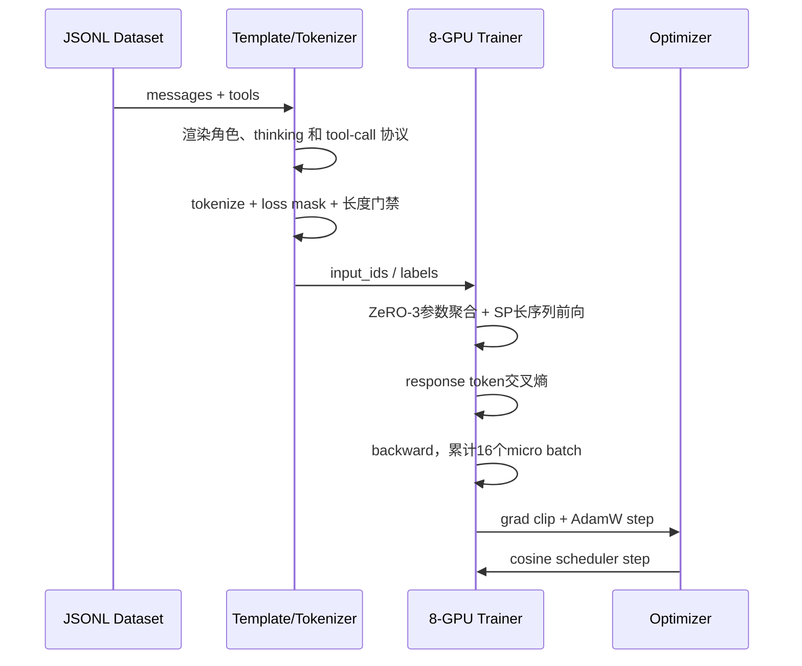
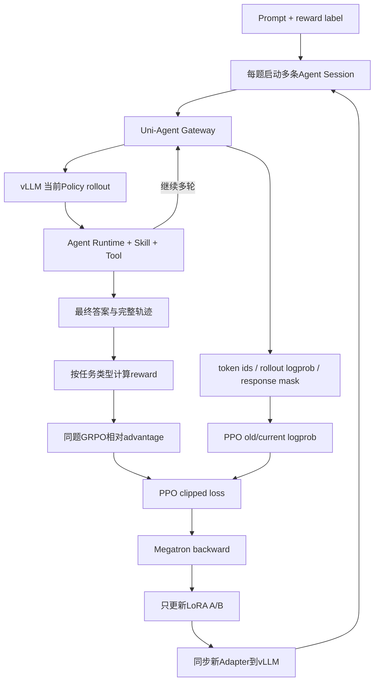
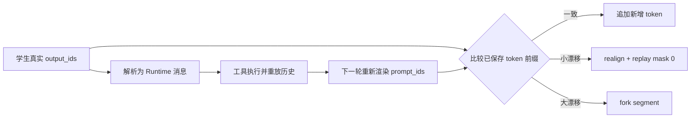
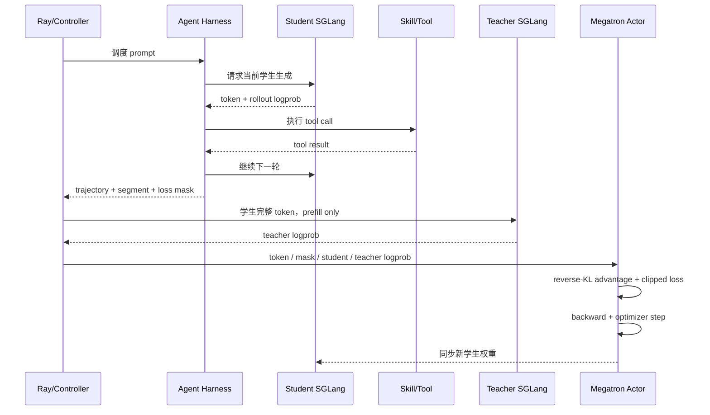

# 第三阶段（中）：SFT 冷启动、任务 RL 与在线策略蒸馏

> 本章按 SFT → RL → OPD 的顺序解释训练思路。示例为合成；各实验使用的模型和配置分别列在第 6 节，不代表同一个 checkpoint 连续经过三轮训练。

第三章解决了“怎样把任务和 Teacher 的执行过程变成训练数据”。接下来，我完成了全参数 SFT、Agent RL 和在线策略蒸馏（OPD）训练，以及相应的数据、协议和训推适配。目标是让专用模型学会使用 Skill，在真实工具反馈下完成任务。

本章把原理、项目配置和故障排查放在一起。**“代表性配置”来自历史训练记录，“合成示例”用于手算，“排查与改进”说明应怎样做；缺少日志或对照实验的地方不写成已验证结论。**

阅读索引：

- [1. 数据、训练对象与完整流程](#1-三步分别在解决什么)
- [2. SFT：模板、loss、优化器和训练基础](#2-sft先让模型学会把任务跑起来)
- [3. RL：奖励、GRPO/PPO、LoRA 和在线更新](#3-rl让模型自己尝试用任务结果比较好坏)
- [4. OPD：教师概率、KL 与 token 对齐](#4-opd学生自己走教师给学生实际生成的-token-打分)
- [5. 资源：TP、PP、DP、EP、显存与耗时手算](#5-训练资源和分布式参数怎样计算)
- [6. 效果：SFT 收益、不同训练对比、pass@k](#6-实际做的是哪些实验结果怎样验收)
- [7. 曲线抖动、不收敛与 CPU/IO 瓶颈排查](#7-训练曲线和异常怎样排查)
- [8. 新数据、重新训练与断点恢复](#8-来了新数据怎样重新训练和恢复)
- [9. 面试叙事与实验记录](#9-面试时怎样串起这段工作)

## 1. 三步分别在解决什么

| 训练方式 | 模型做什么 | 训练反馈来自哪里 | 要解决的问题 |
| --- | --- | --- | --- |
| SFT | 学习 Teacher 已经完成的轨迹 | 示范中下一步应生成的 token | 先学会选 Skill、发出合法调用、读结果并回答 |
| 任务 RL | 对同一道题独立执行多次 | 每次实际执行的任务 reward | 在自己的尝试中提高完整取数、正确选指标的概率 |
| OPD | 当前学生自己执行，教师为学生输出打分 | 教师对学生实际生成 token 的概率 | 在学生遇到的上下文中，提供比整条任务分数更细的反馈 |

SFT 的限制是数据固定：学生上线后可能走进示范没有覆盖的状态。RL 让模型在自己的轨迹上学习，但一条轨迹的任务分数不能直接指出哪一步该改；同题多次尝试全部同分时，相对学习信号也很弱。OPD 则引入教师的逐 token 反馈，提供另一种在线学习信号。

下面沿用第二章的任务：**比较某市居民三个阶梯、非居民、特种行业共五项供水单价，均不含污水处理费。** 同一道示意题用来说明监督方式的变化，不用于证明三个实验的连续收益。

### 1.1 先看一次训练从哪里开始、在哪里结束

| 环节 | 输入与输出 | 为什么需要 |
| --- | --- | --- |
| 固定实验 | 模型、数据、Skill、工具和 scorer 版本 → run 配置 | 确保变化能归因，训练可回放 |
| 清洗与切分 | 问题、标签、Teacher 轨迹 → 合格数据与删除原因 | 排除错误监督和泄漏 |
| 初始化 | 基座或明确 checkpoint → tokenizer、模型、可训练参数、优化器 | 确认从什么能力起步，哪些权重会变 |
| 构造训练样本 | SFT 读取固定轨迹；RL/OPD 在线执行 → token、mask、反馈 | 把业务任务变成可计算的训练信号 |
| 更新 | forward → loss → backward → 梯度裁剪 → optimizer step | 用反馈调整参数 |
| 同步与验收 | 新参数 → rollout 引擎、独立评测 | 下一轮使用新策略，验证是否真正进步 |
| 保存 | 权重、训练状态、配置和指标 → checkpoint | 能部署、比较，或恢复中断的训练 |

这里训练的是“怎样读 Skill、判断候选和调用工具”的模型行为；底层指标库、检索接口和工具执行器仍在模型外部。数据库新增一个数值通常通过实时取数获得，不需要把数值重新记进权重。

### 1.2 数据清洗到底做什么

第三章讲了转换实现；站在训练入口，需要逐道检查下面这些门。历史已有过滤与需要补充的严格校验分别说明，不能把设计要求都算成已落地能力。

| 顺序 | 检查与处理 | 目的 / 失败时怎样处理 |
| --- | --- | --- |
| 1. 问题与标签 | 地区、指标、时间、单位成立，目标可执行，标签与执行证据相符 | 错标签先修正或剔除，不能把模型正确行为罚错 |
| 2. 去重与隔离 | 同源问题及 Teacher、Runtime、slash/nonslash 变体归为一组 | 组级切分 train/validation/test；历史随机切分本身不能证明无泄漏 |
| 3. 会话结构 | 调用与返回可配对，角色顺序合法，结尾完成 | 缺结果、重复配对、孤立返回单列原因；仅比较数量还不够 |
| 4. 行为与结果 | 检查真实执行、最终结果、连续错误、失控循环 | SFT 成功示范过滤不等于只保留从未报错的轨迹 |
| 5. 协议转换 | 统一工具名、参数、Skill 包装和角色边界 | 保留原来的调用分组，不根据文字猜测“应该并行” |
| 6. 工具说明 | 保留真实使用的 Schema，可裁剪未使用工具说明 | 裁的是说明书，不删已发生的工具调用 |
| 7. 模板与长度 | 用本轮 tokenizer/template 重新计 token，检查 loss mask | 超长整条删除是代表性配方；统计长任务被删掉多少 |
| 8. 加载核验 | 对比文件清单、源行数、过滤后数量、任务占比和 token 分布 | 防止脚本声明了一批数据，实际却没加载进去 |

例如“第一次相对路径调用失败，修正后成功取数并正确回答”，应保留完整恢复上下文；“调用成功但最终抄错数值”需要修复监督或剔除。真实无数据时诚实说明缺失可以是正确行为，应单独建立这类任务，不能永远被成功示范过滤排除。

历史 SFT 记录中出现过数组名不一致，使声明的部分数据文件没有实际进入训练的情况。因此验收看最终展开配置与加载统计，不只读启动脚本。这类问题会造成“换了配方但效果没变化”，与模型容量无关。

RL 的数据清洗还要检查 label 非空、reward 可解析、题目难度分布及环境可用性；OPD 重点检查题目可执行、学生轨迹可对齐、教师返回概率完整。两者在线产生的学生轨迹不能一律套用 SFT 的“只留成功示范”规则，否则会丢失用于比较和改进的失败尝试。

### 1.3 训练中几个数量不要混用

| 名称 | 本章含义 |
| --- | --- |
| epoch | 遍历训练数据一次；在线过滤、重采样会改变实际消耗 |
| micro batch | 一次前向/反向实际处理的样本量 |
| gradient accumulation | 先累积几次微批梯度，再更新一次参数 |
| optimizer step | 一次参数更新，学习率调度通常也按这个计数 |
| rollout batch | 本轮发起的题目与会话集合；不一定只对应一个 optimizer step |
| Session / rollout | 一道题的一次完整 Agent 尝试 |
| segment | 一次会话整理出的训练片段，不是新的独立尝试 |
| token 数 | 总上下文 token、模型生成 token、参与 loss token 分开统计 |

同一会话的历史会在多轮输入中反复出现，累计 API 输入 token 可能远大于单轮上下文长度；它不能直接当作峰值显存所对应的序列长度。

## 2. SFT：先让模型学会把任务跑起来

Teacher 已经留下了一条完整示范：

```text
列出五项目标，选择对应 Skill
→ 搜索居民阶梯、非居民、特种行业
→ 确认四项，发现还缺特种行业
→ 用已命中指标的父节点补找，排除污水处理费
→ 取回五项数据，核对时间、单位并回答
```

我把第三章处理好的消息交给训练模板，将角色、工具说明、调用和返回转成模型的 token 序列。模型在每个历史上下文中学习 Teacher 接下来生成什么，例如看到“四项已找到、一项缺失”后，生成补找命令。

**训练时不重新调用工具，工具返回已经保存在示范里。** 问题、Skill 内容和工具结果作为上下文；assistant 的调用与回答计算监督 loss，非空 thinking 是否训练取决于模板和 mask。工具返回本身不作为要模型生成的答案来训练。

这一阶段的具体工作是数据加载、模板与监督位置适配，以及长轨迹的全参数训练。代表性 MoE 实验采用 8 卡、ZeRO-3 和序列并行，解决完整模型训练状态与长上下文的显存开销。

SFT 给模型一个能开始执行任务的基础，但 loss 下降不等于取数正确。假如学生自己搜索时遇到了不同候选、空结果或错误参数，它后续面对的上下文就偏离了固定示范。下一步需要让模型亲自执行，并根据自己的执行结果学习。

### 2.1 SFT：模型到底看到了什么

#### 2.1.1 Template 是模型与 Runtime 的文本协议

训练 JSONL 还不是模型最终看到的 token。Template 会把以下内容拼成一个序列：

```text
System
可用工具 Schema
User Query
Assistant thinking
Assistant tool call
Tool result
Assistant 下一轮 thinking / tool call
...
Assistant final answer
```

对 Qwen Agent 模板，一个简化片段可能是：

```text
<|im_start|>system
You are an assistant.
# Tools
...function schemas...
<|im_end|>

<|im_start|>user
查询三个地区的同一经济指标。
<|im_end|>

<|im_start|>assistant
<think>三个指标彼此独立，可以在同一轮查询。</think>
<tool_call>...</tool_call>
<tool_call>...</tool_call>
<tool_call>...</tool_call>
<|im_end|>

<|im_start|>tool
...结果 A...
<|im_end|>
```

同一个 assistant turn 中出现几个 `<tool_call>`，取决于原始轨迹该 turn 中有几个结构化调用。MS-Swift 的模板负责渲染现有分组，不会读懂 think 后自动把三轮调用改成一轮并行。

#### 2.1.2 哪些 token 计算 SFT loss

系统说明、用户问题和工具返回是条件；模型自己生成的 thinking、tool call 和最终回答才是主要监督目标：

```text
system / user / tool result     labels = -100，loss_mask=0
assistant think / call / answer labels = token_id，loss_mask=1
```

SFT 交叉熵为：

$$
L_{SFT}=-\frac{1}{N}\sum_{t=1}^{N}\log P_\theta(y_t\mid x,y_{<t})
$$

代表性脚本使用 `loss_scale=ignore_empty_think`。它只忽略空的 thinking 区域，不代表删除所有 think，也不会改写 Teacher 的 think 内容。非空 thinking 是否训练，仍由样本与模板的 loss mask 决定。

#### 2.1.3 Thinking 模式必须成套记录

`enable_thinking`、是否补空 think 前缀、chat template 和部署时的 reasoning parser 共同决定 token 形式。训练时看过：

```text
<think>...</think><tool_call>...</tool_call>
```

部署却按另一套 JSON 或无 think 协议解析，即使模型生成了训练时正确的 token，Runtime 也可能把它当普通文本，工具不会执行。

所以实验记录不能只写“某模型 checkpoint”，还要写：

- tokenizer 版本；
- chat/agent template；
- thinking 开关；
- tool-call parser；
- stop token；
- Runtime 及其消息协议。

### 2.2 长上下文全参数 SFT 的代表性配置

| 参数 | 代表性值 | 作用 |
| --- | ---: | --- |
| GPU 进程 | 8 | 每卡一个训练进程 |
| tuner | full | 更新全部可训练参数 |
| dtype | BF16 | 降低显存，同时保持较大指数范围 |
| epoch | 2 | 完整遍历数据两次 |
| learning rate | `5e-6` | 全参数微调使用较小步长 |
| scheduler | cosine + 5% warmup | 初期稳定、后期逐步衰减 |
| micro batch | 1 / GPU | 受超长序列显存限制 |
| gradient accumulation | 16 | 累积多个 micro batch 后更新 |
| max length | 102,400 token | 覆盖长工具轨迹 |
| overlength | delete | 整条删除，避免截断调用与返回 |
| sequence parallel | 4 | 一条长序列的相关计算拆到 4 卡 |
| DeepSpeed | ZeRO-3 | 参数、梯度和优化器状态分片 |
| attention | FlashAttention | 降低长序列 attention 内存与计算开销 |
| padding | padding-free | 避免无效 padding token 计算 |
| gradient checkpointing | 开启 | 反向时重算部分前向，节省 activation |

8 卡、SP=4 时，数据并行度近似为：

$$
DP=8/4=2
$$

有效全局序列 batch 近似为：

$$
1\;(micro)\times16\;(accumulation)\times2\;(DP)=32
$$

它是序列数，不是固定 token 数。Agent 轨迹长短差异很大，每个 optimizer step 的实际 token 量仍会变化。

### 2.3 为什么高显存 GPU 训练 MoE 仍然需要 ZeRO-3

模型名中的 “A3” 只表示每个 token 参与计算的激活参数约为 3B，不表示训练时只需保存 3B 参数。

训练时必须容纳完整模型，并为可训练参数保存梯度和优化器状态。主要开销包括：

```text
BF16 模型权重
+ 梯度
+ Adam 一阶矩
+ Adam 二阶矩
+ 可能存在的 FP32 master state
+ 102.4k 序列的 activation
+ attention、通信和临时 buffer
```

只算 BF16 权重，35B 级参数已经约为 70GB（十进制估算）。加入梯度和 Adam 状态后，静态训练状态会达到数百 GB；102.4k 长上下文的 activation 又是另一块巨大开销。

两种并行解决的是不同问题：

| 技术 | 主要分什么 | 解决的显存 |
| --- | --- | --- |
| ZeRO-3 | 参数、梯度、优化器状态 | 静态模型训练状态 |
| Sequence Parallel | 长序列相关 activation 与计算 | 超长上下文中间激活 |

因此，即使单卡显存很大，MoE 每 token 只激活少量专家，也不能替代 ZeRO-3。MoE 节省的是每 token 计算量，不会自动删掉未激活专家的权重和优化器状态。

### 2.4 一次 SFT step 怎样发生



训练 loss 或 token accuracy 只能说明模型对标准 token 的拟合程度。它不能替代 Agent 评测：模型可能正确生成 XML，却选错 Skill；也可能调用格式合法，却漏掉业务所需指标。

### 2.5 交叉熵、AdamW、学习率和梯度裁剪各管什么

交叉熵衡量标准 token 被模型赋予多大概率。比如同一个正确 token，概率从 0.1 提高到 0.8，负对数从约 2.30 降到 0.22。预测有一位位移：位置 t 的 logits 预测下一个 token，label 和 mask 必须随之对齐，不能把当前位置 token 当预测答案。

AdamW 用梯度的一阶、二阶移动统计调整更新幅度，weight decay 单独约束权重；它不负责判断金融结果是否正确。learning rate 控制每次更新的尺度，warmup 避免刚开始更新过猛，后续衰减用于逐渐收敛。全参数更新通常需要比小 Adapter 更谨慎的步长，但不能只靠训练方式固定一个万能学习率。

一次累积更新的逻辑是：

```text
清空上一轮梯度
→ 读取一个 micro batch，前向计算有效模型 token 的 loss
→ 按累积与分布式归一化约定反向，累加梯度
→ 重复到累积次数满足
→ 在正确的分片/并行组上检查全局梯度范数并裁剪
→ optimizer.step，scheduler.step
→ 清空梯度，进入下一轮
```

梯度裁剪限制本次梯度范数，与 PPO 的概率比裁剪不是同一件事。BF16 降低存储且指数范围较大，但不保证永不出现 NaN；attention softmax、归约和优化器状态可以使用更高精度。不能看到 NaN 就只归咎于显存或盲目改 dtype。

长短轨迹混合时，还要明确 loss 是“所有有效 token 求平均”，还是“每条序列先平均再对序列平均”。前者通常让长输出贡献更多；后者让每条序列权重更接近。梯度累积、DP 归约和不同 micro batch 的有效 token 数也要一起核对，避免同一份 loss 重复除以 batch，或小微批被过度加权。

### 2.6 正式开训前怎样确认链路正确

先在很小的已核验样本集上检查：最终渲染文本、角色边界、工具调用、label 位移、有效 token 比例、可训练参数名，以及一个更新前后的参数差异。小样本过拟合检查只用于发现实现错误，不算泛化收益。

然后分别运行基座与 SFT checkpoint 的实际 Agent 任务。基础验收至少包括 Skill 选择、调用格式、必填参数、目标覆盖、结果使用和最终答案。只有 loss 而没有执行评测，无法区分“学会了协议”和“学会了正确取数”。

## 3. RL：让模型自己尝试，用任务结果比较好坏

RL 阶段输入的是问题和评分所需标签。模型只收到任务与可用工具，标签留给 reward 程序；没有预先规定的标准工具轨迹。当前策略对每道题生成多条独立的 Agent 会话，真实执行搜索、目录补找和取数。

以水价任务为例，假设评分只比较最终成功取回的指标集合与五项目标集合，三次尝试可能是：

| 尝试 | 执行结果 | 集合 F1（示意） |
| --- | --- | ---: |
| A | 正确取回四项，漏掉特种行业 | 0.89 |
| B | 正确取回五项，没有额外指标 | 1.00 |
| C | 正确取回五项，又多取一项污水处理费 | 0.91 |

这时训练可以鼓励 B 对应的行为，抑制相对较差的尝试。**这些分数是指定评分口径下的演示，不是历史 reward 回放；实际 reward 统计什么，必须核对当前解析器和标签。** 其他 Skill 的完成标准不同，表格取数需要对齐单元格，文档定位要检查文档命中，不能全部套用指标集合 F1。

一次更新的过程是：

```text
同一道题采样多条完整会话
→ 执行工具，收集轨迹和实际结果
→ 按任务类型计算 reward
→ GRPO 比较同题各次得分，得到相对 advantage
→ PPO-clip 在模型生成位置更新策略
→ 将新权重同步回推理引擎，继续采样
```

这里的 advantage 可以理解为“这次比同题其他尝试好多少”。它来自组内比较，不是分数高于某条固定及格线就一定为正。代表性 MoE 实验冻结基座，只更新 LoRA 参数；LoRA 决定更新哪些参数，RL 决定用什么反馈学习，两者不是同一概念。

我完成的工作包括多 Skill reward 接入、在线 Agent 轨迹与 token/mask 收集、GRPO/PPO 训练配置、MoE 训推路由对齐和 Adapter 同步。Reward 还必须与工具返回协议一起检查：如果解析器漏读字段，实际成功的取数也可能得不到应有分数。

**引入 OPD 的动机在于反馈粒度。** 任务 reward 能比较完成度，但通常给整条会话一个分数。如果八次都漏掉同一项，组内没有差异，就很难靠相对比较学到补找；即使分数不同，也没有直接标明错误发生在哪个 token。OPD 从教师取得逐 token 的概率反馈，针对的是这种监督粒度问题。它仍需独立评测，不能据此断言一定优于任务 RL。

### 3.1 Agent RL：题库里为什么没有标准工具轨迹

RL 数据只需要提供：

```json
{
  "prompt": [{"role": "user", "content": "重新编写的金融任务"}],
  "data_source": "indicator_task",
  "reward_model": {"style": "rule"},
  "extra_info": {
    "metadata_json": "{...}",
    "label_json": "{...reward 所需标签...}"
  }
}
```

标签不作为 assistant 标准答案喂给模型。它只在 rollout 完成后供 reward 代码判断任务是否完成。

异构标签先序列化成 JSON 字符串，是为了保持 Parquet 顶层 Schema 稳定：指标任务可能是目标指标集合，表格任务可能是期望单元格，报告任务可能是文档代码。Reward 阶段再按 `data_source` 反序列化。

工具选择、调用数量、并行结构和失败恢复全部由当前 policy 在线生成。

### 3.2 RL 的完整闭环



系统组件的职责：

| 组件 | 职责 |
| --- | --- |
| verl Trainer | 采样调度、batch、advantage、loss 与训练流程 |
| vLLM Rollout | 使用当前 Base + LoRA 高并发生成 |
| Uni-Agent Gateway | 连接模型与 Agent，保存 token、logprob、mask 等训练真值 |
| Agent Runtime | 驱动多轮 Session、Skill 与工具执行 |
| Reward | 根据轨迹和标签计算任务完成质量 |
| Megatron | 分布式前向、反向与 LoRA 参数更新 |

### 3.3 Reward 为什么必须按任务类型设计

不同 Skill 的“正确”并不是一种形态：

| 任务类型 | 代表性 reward |
| --- | --- |
| 指标检索 | 实际查询指标集合与目标集合的 Precision / Recall / F1 |
| 表格取数 | 列名、日期、单位和单元格对齐后的 Table F1 |
| 报表定位 | 目标文档代码的 Hit@1 / Hit@5 |
| 新闻检索 | 文档 ID、标题、URL 与要点覆盖 |
| 公告、研报、企业查询 | 多次 LLM-as-a-Judge 后聚合 |

以指标检索为例：

```text
TP = 查到且属于标签的指标
FP = 查了但标签不需要的指标
FN = 标签需要但没有查到的指标

Precision = TP / (TP + FP)
Recall    = TP / (TP + FN)
Reward    = F1
```

这样既惩罚漏查，也惩罚为了碰运气而大量查询无关指标。只对最终回答文字做 Judge，可能看不到 Agent 实际调用了错误指标。

#### 3.3.1 指标集合 reward 与业务正确性并不总是等价

第一章中，完整月度值可能足以计算季度总量；如果 reward 严格匹配标签中的季度指标 ID，这条替代路径可能被记为漏查季度指标、又多查月度指标。对于“定位指定指标集合”的任务，这种约束可以合理；对于“给出可计算的业务答案”的任务，它可能只是有偏的代理目标。

因此需要明确评分对象：计入集合的是搜索候选、发出的取数请求，还是成功返回有效数据的指标？是否接受口径一致、可计算的替代指标？探索动作与最终答案如何分别计分？当前公开示例没有给出完整等价规则，不能宣称 Set F1 已覆盖所有业务正确路径。

回归 reward 时，可以使用 [项目地图中的合成 Case](00-project-map.md)，分别检查直接季度取数和月度求和路径。若业务定义接受两者，就应通过可验证的等价映射或计算校验处理；这属于评分设计要求，不代表历史版本已经实现。

#### 3.3.2 Reward 还要跟工具输出协议一起回归

即使 F1 公式正确，parser 读不到当前工具返回中的指标字段，也会使有效调用无法计分。检查时应先验证工具返回能否解析、提取了多少目标、标签是否非空，再计算 reward。字段缺失和真实空集合应有不同状态，不能都静默当作 0。

训练 reward 与离线 scorer 也可能使用不同目标或聚合方式。版本变化后，用固定合成 Case 对比期望集合、解析结果与最终分数，才知道分歧来自模型行为还是评分协议。

#### 3.3.3 一个可审计的 reward 应怎样计算

先定义计分对象。以“成功取回指定指标集合”为例，设目标集合为 G，程序从可信工具执行记录中抽出的成功取数集合为 P。搜索返回的候选、模型声称查询过的名称都不应直接算作成功取数。这是本例评分合同，历史各版本是否满足需要逐项回放。

$$
R_{set}=\frac{2|P\cap G|}{|P|+|G|}
$$

当 G 非空、P 为空时记 0；G 本身为空或解析失败时应产生独立状态，不能悄悄当正常样本。若任务允许等价指标或可验证的聚合计算，需要先做等价判定；否则奖励优化的是“标签 ID 集合命中”，未必是全部业务正确路径。

评分流程应是：任务标签校验 → 工具事件解析 → ID/名称与口径归一 → 去重 → 成功与有效数据判定 → 集合或单元格比较 → 输出分数及 TP/FP/FN、解析状态。单位、日期和数值正确性不在集合 F1 里自动得到保证，应由任务评分合同明确纳入。

最终回答准确性和过程效率是另外的维度。可以设计“正确完成后才奖励更少的无效调用”，但不要直接奖励短回答、少调用或重复输出标签，否则模型可能学会提前停止。新增格式奖励、长度惩罚或过程奖励时，要记录各分项尺度及权重，再做对照；本章不把这些建议写成历史已经使用的复合 reward。

对 LLM Judge，固定 rubric、输入证据和聚合方式，保留多次判定的分歧；Judge 失败或接口超时要独立标记。训练标签与评分器应隔离在 Agent 不可读取、不可修改的位置，工具执行记录也不能只靠模型可改写的答案文件。

### 3.4 GRPO：同一道题的多次尝试怎样互相比较

代表性实验对每道题启动 8 个独立 Agent Session。设它们的任务 reward 为 `r_1...r_8`：

$$
A_i=\frac{r_i-mean(r_1...r_8)}{std(r_1...r_8)+\epsilon}
$$

关键点是：reward=0.5 不一定得到正 advantage。如果同题其他尝试平均为 0.8，这条轨迹仍然相对较差；如果其他尝试平均为 0.2，它就是正向样本。

如果 8 条轨迹全部同分，组内标准差接近 0，几乎没有相对学习信号。动态难度筛选的意义正是把预算集中到“模型有时能做对、但还不稳定”的题，而不是全对或全错的题。

一条 Session 还可能物化成多个 trajectory segment。实现中应只用每个 Session 的最终段参与 8 次独立 reward 的组内统计，再把该 Session 的 advantage 广播给较早段，避免“物化段更多的 Session”被错误当成更多次独立 rollout。

#### 3.4.1 手算一次组内 advantage

用四次尝试演示，reward 为 `[0, 0.5, 0.5, 1]`。均值为 0.5，按总体标准差计算约为 0.3536，忽略很小的 epsilon 后，advantage 约为 `[-1.414, 0, 0, 1.414]`。实际框架是否使用无偏标准差、是否缩放 reward，要看实现配置。

分数 0.5 的两次在这组里不产生相对优势；分数 1 的尝试得到正优势。若四次全为 0.5，减去组均值后都是 0，这组没有任务项的相对策略梯度；独立 KL 或 entropy 项若开启，仍可能产生梯度。

标准 actor-critic PPO 通常用价值网络估计基线，并可用 GAE 计算 advantage。GRPO 用同题多个结果的组统计代替价值网络，节省 critic 的资源，但增加同题采样成本。**本项目这条路线是“GRPO 算 advantage，PPO-style clip 做更新”，不是先完成一轮 GRPO 再训练另一轮 PPO。** 方法关系见 [DeepSeekMath 的 GRPO 说明](https://arxiv.org/html/2402.03300v3#S4.SS1)。

同分组过滤要同时监控保留比例和题型分布。全错可能是太难，也可能是 reward 读不到输出；全对可能已学会，也可能是标签泄漏。未经检查直接过滤，会把错误藏起来。历史 R3 配置与 IS/RS 变体不同，`reward_manager=dapo` 这个名字本身不证明启用了难度过滤。

#### 3.4.2 Actor、Critic、Reward 和 Reference 分别是谁

| 角色 | 负责什么 | 本章路线里是否需要 |
| --- | --- | --- |
| Actor / policy | 生成动作，是被更新的模型 | SFT、RL、OPD 都有被训练模型 |
| Reward 程序或模型 | 根据执行结果评价任务 | 任务 RL 使用；纯 OPD 不依赖业务 reward |
| Critic / value model | 估计当前状态后续能取得的回报，用于降低 advantage 方差 | 标准 actor-critic PPO 常用；本章 GRPO 组统计替代它 |
| Old policy | 本批样本更新前的策略，提供概率比分母 | PPO-style update 使用 |
| Reference | 固定的参考策略，用于控制长期偏离 | 可独立关闭，不等于 old |
| Teacher | 对学生 token 提供概率反馈 | OPD 使用，通常固定不更新 |

在 actor-critic PPO 中，常见 GAE 从 TD 误差开始：

$$
\delta_t=r_t+\gamma V(s_{t+1})-V(s_t),\qquad
\hat A_t=\sum_{l\ge0}(\gamma\lambda)^l\delta_{t+l}
$$

V 是 Critic 估计，终止状态的后续价值取零；gamma 控制未来回报折扣，lambda 控制多步估计的权衡。这是理解标准 PPO 的对照公式，不是说本章 GRPO 还训练了一个 Critic。任务 Reward 判断完成得好不好，Critic 预测接下来能有多好，两个“打分”职责不同。

### 3.5 Response mask：工具返回很长，但不应该被训练

在线轨迹中的 response 区域可能包含：

```text
assistant tool call           mask=1
工具返回的大段数据              mask=0
环境注入的角色标记与模板胶水      mask=0
assistant 分析和最终回答         mask=1
```

一个 20k token 的物化轨迹，真正参与 policy loss 的模型 token 可能只有几百个。工具结果必须进入上下文，因为后续决策依赖它；但不能让模型学习复述环境自动插入的数据。

标量 reward 通常放在最后一个有效 response token 上，再由 GRPO 得到的序列级 advantage 广播到所有 `response_mask=1` 的 token。

### 3.6 PPO-clip 怎样更新 LoRA

GRPO 产生 advantage 后，Actor 计算：

$$
ratio_t=\exp(\log P_{current}(y_t)-\log P_{old}(y_t))
$$

并在有效模型 token 上使用非对称 clip，例如 `[0.8, 1.28]`。正 advantage 提高动作概率，负 advantage 降低动作概率；clip 限制一次更新过大。

LoRA 不直接改冻结权重 `W`：

$$
W_{effective}=W+\frac{\alpha}{r}BA
$$

代表性配置：

```text
rank    = 16
alpha   = 32
dropout = 0
scale   = alpha / rank = 2
```

LoRA 覆盖 attention 和大量 MoE 专家投影。即使 rank 只有 16，只要层数、专家数和目标矩阵很多，Adapter 仍可能达到数十亿参数和数 GB；“用了 LoRA”不等于权重文件一定很小。

#### 3.6.1 PPO 概率比、old policy 和裁剪手算

同一个历史前缀 h 和实际生成 token y，概率比是：

$$
\rho_t=\frac{\pi_\theta(y_t\mid h_t)}{\pi_{old}(y_t\mid h_t)},\qquad
L_t=-\min\left(\rho_t A_t,\operatorname{clip}(\rho_t,0.8,1.28)A_t\right)
$$

例如 A=1、ratio=1.5，目标取 min(1.5,1.28)=1.28，继续增加这个概率不再增加这项收益；A=−1、ratio=0.5，目标取 min(−0.5,−0.8)=−0.8，避免无限奖励把坏动作概率降得更低。方向相反、让策略变差的更新并不会被同样截住。clip 也不是硬性保证所有 ratio 或 KL 都在阈值内。[PPO 原论文](https://arxiv.org/abs/1707.06347)

这里至少有三份概率要区分：rollout 引擎采样时记录的概率、更新前 old Actor 的概率，以及正在更新的 current Actor 概率。若采样引擎与 Actor 的路由、精度、模板不同，即使权重版本相同，两者也未必完全一致；需要区分 PPO 的 current/old 比和额外的 old/rollout 修正，不能重复乘同一个 importance ratio。

old 是本批更新的基线，reference 通常是固定模型，两者也不是一个角色。多次更新同一批数据时 old 保持固定，current 变化；更新过多会增加样本与当前策略的偏离。排查时观察 ratio 分位数、clip fraction、KL 和权重版本，而非只看 loss 的正负。

#### 3.6.2 LoRA 怎样初始化，为什么不能两边都为零

对线性层 W 的形状 `d_out × d_in`，A 为 `r × d_in`，B 为 `d_out × r`。常见线性 LoRA 初始化是 **A 用 Kaiming 随机初始化，B 为零**，于是初始 BA=0，插入 Adapter 后的函数从原模型起步。[PEFT 初始化说明](https://huggingface.co/docs/peft/package_reference/lora)

忽略缩放常数，用 G 表示损失对增量矩阵的梯度：

$$
\nabla_B L=GA^T,\qquad \nabla_A L=B^TG
$$

第一步 B=0，所以 A 的这部分梯度为零，但 B 可以更新；B 变成非零后，A 也开始学习。如果 A、B 都为零，两边这部分梯度都会为零。实际初始化还受层类型、转置约定和框架实现影响，不能把 PEFT 的通用默认当作所有 Megatron 层的实测事实。项目历史记录的配置为 rank=16、alpha=32、dropout=0、init=kaiming，重新开跑时应检查初始化代码和首步梯度。

冻结 Base 只是不保存并更新它的参数梯度/优化器状态；模型仍要经过 Base 前向，且中间梯度要穿过冻结层传到 LoRA，所以计算量不会缩小成“只算 Adapter 的参数量”。

#### 3.6.3 rank=16 是否太小，怎样判断

单个矩阵新增参数量是 `r × (d_in + d_out)`。示意方阵 4096×4096 原有 16,777,216 个参数：r=16 增加 131,072 个，r=64 增加 524,288 个。覆盖的层数、专家数和 target modules 都会把这个数量继续放大；历史大 MoE Adapter 记录约为 33 亿参数、BF16 约 6.6GB，因此 rank 数字小并不代表总更新规模很小。

**现在没有 rank 消融证明“秩不够大”。** 容量不足的候选信号是：数据与 reward 正确、梯度有效、合理学习率下仍无法拟合训练任务，扩大 rank 后在可比预算下改善。若训练分高、验证分低，应先查过拟合和数据分布；若所有任务 reward 为零，应先查评分与执行。

建议对 r=16/32/64 做受控对比，固定基座、数据、模块、采样和评测；使用 alpha/r 相同作为一组缩放控制，同时记录绝对 alpha、学习率、参数量、实际 token 和 GPU-hours。相同缩放不能保证不同 rank 的优化动态完全相同，因此需要多 seed 或复跑，不能把某次更高分自动归因于 rank。

全参数 SFT、LoRA SFT、LoRA RL 与全参数 OPD 的区别应拆成“更新范围”和“监督目标”两轴。换基座、换数据又换训练方法后的差异，无法当作 LoRA 对全参数的独立消融。

### 3.7 MoE 训练中的 R3 Router Replay

同一个 token 在 vLLM rollout 与 Megatron Actor 中，如果被 Router 分到不同专家，那么 current/old logprob 差异中会混入“计算路径不同”的误差。PPO 可能把它误认为策略参数变化。

R3 的处理：

```text
vLLM rollout
→ 保存每层、每个 token 的 Top-K routed experts
→ routed experts 随 trajectory 进入训练 batch
→ Megatron 前向重放 rollout 时的专家选择
→ 在尽量相同的计算路径上比较 logprob
```

重放不能只覆盖最后的回答 token。回答 logits 依赖前面的 Prompt、历史回答和工具上下文形成的 hidden state，因此影响因果前缀的路由也需要对齐。

R3 解决的是“两个推理/训练引擎选了不同专家”。另一类 IS/RS 实验处理的是“rollout policy 与 current policy 已经相差太远”：前者重放路由，后者估计概率比并裁掉过度 off-policy 的 token 或序列。两者不能混为同一个算法开关。

### 3.8 两节点 MoE LoRA RL 的代表性并行

| 并行维度 | 代表性值 | 切分对象 |
| --- | ---: | --- |
| TP | 1 | 本轮不再切单个 Dense 矩阵 |
| PP | 2 | Transformer 层分成两个流水段 |
| EP | 8 | MoE 专家分散到 8 个 Expert Rank |
| CP | 8 | 96k 上下文沿序列维度切到 8 卡 |
| rollout TP | 4 | vLLM 推理权重切到 4 卡 |

对于 96k 上下文：

$$
96,000 / CP8 = 12,000\;token/context\;rank
$$

16 张 GPU 主要用于容纳 PP、EP、CP 组合后的大 MoE 和长上下文，而不是简单复制出大量数据并行副本。训练与 rollout 分阶段复用资源，并使用参数、梯度、优化器 offload 以及 FP8 KV cache 控制显存。

### 3.9 RL 代表性配置与证据边界

| 参数 | 代表性值 |
| --- | ---: |
| Prompt batch | 8 |
| Session / prompt | 8 |
| Epoch | 5 |
| LoRA learning rate | `1e-5` |
| Temperature / top-p / top-k | `1 / 1 / -1` |
| Max Agent turns | 30 |
| Max context | 96k |
| vLLM KV cache | FP8 |
| PPO clip low/high | `0.20 / 0.28` |
| Save / eval interval | 10 step |

不同实验变体还同时改变了数据配方、学习率、长度、micro batch、R3 与 IS/RS 设置。因此，不能只看两条训练曲线就把差异全部归因于某一个机制。要证明 R3、IS 或 rejection sampling 的独立收益，需要单变量消融。

### 3.10 Reward hacking：本项目有没有证据，怎样防止

Reward hacking 指优化器找到能提高代理分数、却不满足真实目标的行为。它不要求模型有主观“作弊意图”，但需要高奖励与低业务质量的可复核背离。现有可核查材料确认了 reward 解析错配，尚不足以证明训练中已经发生了特定的奖励投机，也不足以声称已经彻底避免。

| 风险场景 | 怎样发现 | 应怎样约束 |
| --- | --- | --- |
| 不取数，只在答案里列目标指标 | 高 reward 轨迹缺少真实执行记录 | 从隔离的工具事件取证，核对成功数据 |
| 把大量无关指标都查一遍碰标签 | Recall 高，Precision 和成本恶化 | 同时报 Precision/Recall/F1；约束无效探索 |
| 多次输出标签、伪造工具返回 | 回答与执行事件不一致 | 奖励依据使用可信事件，不接受模型自报 |
| 靠短答、提前结束拿效率分 | 调用数下降，但目标覆盖下降 | 先过正确性门槛，再讨论效率 |
| 反复重试直到 Judge 给高分 | 得分依赖重试次数、Judge 方差高 | 固定评分预算与聚合方式，记录原始判定 |
| 只针对固定测试题记答案 | 训练集表现高，换实体/时间就失败 | 同源隔离、固定未见任务和反例检查 |

集合 F1 能惩罚一部分多取行为，不能解决所有漏洞，尤其不能自动保证数值与时间正确。预防方案需要用“故意构造的坏轨迹”回放：不调用工具、错口径、空数据、重复标签、缺少地区时，应得到预期低分或明确无效状态。随后抽查高 reward 轨迹的实际答案，比较独立 scorer，而不只看训练分上涨。

历史排查发现旧 reward 只识别旧版指标字段，新版工具输出几乎全部被漏读。回放 575 条轨迹时，旧解析器仅在 1 题提取到指标，而正式评测逻辑可在 574 题识别指标。这更直接支持“训练信号可能失真或消失”；缺少对应成功训练任务的代码 hash、完整 reward 分布和修复重训对照，不能写成已闭环的因果结论。

### 3.11 一次 RL step 的实际目的和产物

| 步骤 | 做什么 | 必须记录的产物 |
| --- | --- | --- |
| 取题 | 本轮 8 道题，各启动 8 次独立尝试 | 题目 ID、组 ID、Session ID，合计 64 个 Session |
| 执行 | 当前策略生成调用，Runtime 执行工具并反馈，直到完成或预算耗尽 | 权重版本、实际 token、工具事件、停止原因 |
| 整理 | 将多轮会话物化为训练片段，处理历史重放和 mask | 每段所属 Session、有效 token、路由记录 |
| 打分 | 按任务解析成功执行与标签 | reward、分项、解析状态、耗时 |
| 组内比较 | 每个 Session 用一次最终结果参与 GRPO | 组均值/方差、advantage、同分组比例 |
| Actor 更新 | 算 old/current logprob、clip loss、反向与优化 | ratio、KL、clip fraction、梯度范数、学习率 |
| 同步 | 将更新后的 Adapter 传回 rollout 引擎 | Actor/rollout 版本一致；必要时用固定输入对照 |
| 评测与保存 | 按间隔执行固定测试并存盘 | 分项成绩、轨迹、checkpoint 内容清单 |

64 个 Session 不是 64 个“同时运行”的会话：并发上限会让它们分批执行。若一次会话物化成多个 segment，训练行数还会多于 64。R3 代表性配置对未完成 episode 屏蔽训练位置，另一变体未这样处理；需要报告未完成比例，否则模型可能只从容易完成的任务学习。

算法配置中的 PPO minibatch=16，表示将收集的数据进一步拆分做更新；不能仅凭“prompt batch=8”说每个日志 step 只反向一次。实际 optimizer step 数还受 PPO epoch、片段数量、动态 batch 和有效 mask 影响。

## 4. OPD：学生自己走，教师给学生实际生成的 token 打分

OPD（On-Policy Distillation）也让当前学生真实执行任务。与任务 RL 相比，主要变化是训练反馈：从“这次任务拿了多少分”，变成“在这个历史上下文中，教师给学生生成的 token 多大概率”。

仍以已经找到四项水价、缺一项为例。学生可能继续搜索，也可能沿父节点补找，甚至提前回答。Teacher 不接管工具执行，也不重新提供一条标准轨迹，而是对学生实际走过的输出进行概率计算：

```text
当前学生执行完整 Agent 任务，保存真实 token 和生成位置
→ 将学生的 token 序列送给 Teacher
→ Teacher 只做前向计算，返回这些 token 的 log probability
→ 在相同前缀、相同 token 上比较学生与教师概率
→ 构造逐 token 的 advantage，更新学生
→ 同步新学生权重，再执行下一批任务
```

在代表性的纯 OPD 配置里，如果教师比学生更认可某个已生成 token，它得到正向 advantage；反之则为负。随后通过 clipped policy update 更新学生。**这是概率反馈，不是教师逐条写自然语言评语，也不等于教师准确定位了业务错误。** 教师偏好的行为仍然要接受真实任务评测。

和 SFT 的区别也在这里：SFT 模仿固定 Teacher 轨迹；OPD 的上下文和动作来自当前学生，教师在这些实际遇到的状态上提供反馈。纯 OPD 实验的业务 reward 固定为 0，学习信号来自教师与学生的概率差，不表示“没有训练信号”，也不要求把前一节 RL 的业务分数叠加进来。

我在 4B 学生实验中完成了教师打分、在线轨迹整理与全参数更新链路。关键适配是保持 token 一一对应：Runtime 把调用解析成消息、执行工具再重放历史时，文本可能重新渲染；训练必须记录真实 token，并处理前缀漂移，不能仅靠解码后的文本重新拼一遍。工具返回参与上下文，但不参与模型输出位置的 loss。

### 4.1 OPD：学生 response、rollout 与 segment 的区别

| 名称 | 含义 |
| --- | --- |
| 一次 response | 学生收到一次 prompt 后新生成的一段 token，可能是 tool call 或 final answer |
| 一条 rollout | 一个问题从开始到结束的完整多轮 Agent 会话 |
| 一个 segment / Sample | TrajectoryManager 线性化后的训练单元；一条 rollout 可能因 token 漂移产生多个 segment |

```text
prompt_1 = system + user
response_1 = 学生生成 tool call

执行工具后：
prompt_2 = system + user + response_1 + tool_result_1
response_2 = 学生继续调用或最终回答
```

如果把每一轮重新当成独立样本，`response_1` 会在后续 prompt 历史中重复出现，容易被重复训练。

TrajectoryManager 将它整理为：

```text
首轮 system / user               mask=0
学生 response_1                  mask=1
工具结果与下一轮上下文            mask=0
学生 response_2                  mask=1
...
```

环境 token 参与前向条件，但不参与 policy loss；每段学生输出只训练一次。

### 4.2 训推来回流转时怎样保持 token 对齐

在线 Agent 的路径跨越多个系统：

```text
Agent Runtime
→ Anthropic/OpenAI Adapter
→ Student SGLang
→ tool call parser
→ 工具环境
→ Runtime 重放历史
→ 下一轮 Student SGLang
```

危险点在于：学生第一轮生成的 token 被解析成消息后，Runtime 下一轮又把历史文本传回来。如果重新渲染和 tokenize，空格、特殊 token 或 tool-call 包装可能发生漂移。

代表性实现做了三层处理：

1. **统一入口模板**：Adapter 使用学生 checkpoint 对应的 tokenizer 与 chat template。
2. **保留真实 token**：每轮直接记录 SGLang 的 `prompt_ids`、`output_ids` 和 rollout logprob，不把解码文本当唯一真相。
3. **前缀比对与分叉**：
   - 完全一致：只追加新尾部；
   - 最近一轮附近的小漂移：realign，重放部分 mask 为 0；
   - 差异过大或过早：fork 新 segment，避免强行错配。



这解决的是消息协议往返造成的对齐问题。Actor 更新后还必须把新权重同步回 rollout engine，否则下一批仍由旧学生生成，也会破坏 on-policy 假设。

### 4.3 OPD 教师怎样评价学生

教师不会重新生成一条“正确回答”。学生完成 rollout 后，系统把最终 `Sample.tokens` 原样送给教师，并设置：

```text
max_new_tokens = 0
return_logprob  = true
```

教师只做 prefill，返回：

$$
\log P_{teacher}(y_t\mid y_{<t})
$$

其中 `y_t` 是学生实际生成的 token。训练位置按相同 token ID 对齐：

```text
同一历史前缀 + 同一个学生 token
学生认为它的概率是多少
教师认为它的概率是多少
```

工具结果位置即使有教师 logprob，也会被 `loss_mask=0` 排除。

这要求教师和学生 tokenizer/词表兼容。系统直接传 token ID；如果同一个 ID 在两边代表不同 token，教师概率就没有意义。

### 4.4 OPD loss 不是普通的完整词表 KL

对学生实际采样 token：

$$
r_t^{reverseKL}=\log P_{student}(y_t)-\log P_{teacher}(y_t)
$$

纯 OPD 代表性实验把业务 reward 固定为 0，再构造：

$$
A_t=-\beta\left(\log P_{student}(y_t)-\log P_{teacher}(y_t)\right)
$$

当学生比教师更偏爱某个 token，advantage 为负；当教师比学生更认可这个 token，advantage 为正。随后进入 PPO-style clipped policy loss：

$$
ratio_t=\exp(\log P_{new}(y_t)-\log P_{old}(y_t))
$$

$$
L_t=-\min\left(ratio_tA_t,\;clip(ratio_t,1-\epsilon_l,1+\epsilon_h)A_t\right)
$$

代表性配置：

```text
task reward       = 0
opd_kl_coef       = 1.0
reference KL      = 0
entropy bonus     = 0
eps clip low/high = 0.20 / 0.28
```

所以更准确的描述是：

> 使用学生 on-policy token、外部教师 token logprob 构造 reverse-KL advantage，再通过 PPO-style clipped policy update 更新学生。

它复用了 GRPO/PPO 的基础设施，但本轮没有业务 reward，其监督信号与前面按业务结果打分的任务 RL 不同。

### 4.5 OPD 的代表性训练拓扑

| 参数 | 代表性值 |
| --- | ---: |
| prompt 数据 | 约 7.9k 道任务题 |
| 评测集 | 70 题，7 类任务各 10 题 |
| rollout batch | 8 个 prompt |
| samples / prompt | 8 条学生轨迹 |
| global batch | 64 |
| max context | 80k |
| max response | 9,600 |
| learning rate | `1e-6` constant |
| Actor | 4 GPU，TP=2、DP≈2 |
| Student rollout | 2 GPU SGLang |
| Teacher | 独立 SGLang 服务，不占上述 6 GPU |
| max Agent turns | 30 |
| max concurrent rollouts | 12 |

一次训练 step：



OPD 日志中任务 reward 为 0 是设计行为，不代表训练没有信号。应检查 teacher/student alignment、loss、有效 token 比例和最终统一 Agent 评测，而不能把 reward=0 当成训练失败。

### 4.6 OPD 里的 KL 方向、采样近似和反馈粒度

记学生分布为 p，教师分布为 q，在同一个历史上下文 h 上：

$$
D_{KL}(p\|q)=\sum_y p(y\mid h)\log\frac{p(y\mid h)}{q(y\mid h)}
$$

这叫学生到教师的 reverse KL；相反方向 `KL(q || p)` 按教师分布加权，是另一目标。完整词表 KL 对每个可能 token 求和；本章实现只为学生实际采到的 token 取得教师概率，用采样估计构造 advantage，不是逐位置保存整张词表概率再精确求和。

对学生实际生成的 token，若学生概率为 0.2、教师为 0.4，`log(0.2/0.4)≈−0.693`；beta=1 时对应 advantage 为 +0.693。反过来学生 0.4、教师 0.2，advantage 为 −0.693。这只是单个采样项，所以可以为负；**真正的 KL 是期望，不小于零**。不能因为某个 token 的 log-ratio 为负就说 KL 实现错了。

采样分布、old/current 概率和 stop-gradient 位置要一致；本项目通过策略梯度式的 advantage 和 clipped update 优化，不是直接对打印出来的 log-ratio 求导就等价完成全部训练。在线 rollout 来自哪个学生版本，教师和 Actor 比较的 token 是否一致，是检查公式实现前的前提。

还要区分三种诊断：

| 比较对象 | 用途 | 能否当作最终业务分 |
| --- | --- | --- |
| student 与 Teacher | OPD 学习信号，向教师分布靠近 | 不能 |
| current 与固定 reference | 常规 RL 的策略偏离约束，可独立开关 | 不能 |
| current 与 old / rollout | 检查单批更新幅度、采样滞后及训推偏差 | 不能 |

所以 `reference KL=0` 与 `OPD beta=1` 可以同时成立。增大 beta 不等于免费获得更准确的教师知识：它会改变 advantage 尺度，并与学习率、clip 和梯度裁剪共同影响更新。应同时看 log-ratio 分布、梯度、有效 token 和固定任务成绩。

教师概率也有边界：教师可能偏好流畅但业务错误的续写；一个错误动作由多个 token 组成，逐 token 概率不等于逐业务步骤的正确性标签。纯 OPD 并不自动修复坏标签、不可用工具、目录质量或 reward 的解析错误。

### 4.7 教师服务失败和多轮对齐失败怎样处理

教师超时、缺少某些位置 logprob、返回 NaN，或教师/学生 tokenizer 不兼容时，应将样本标为无效并统计，而不是补零概率继续更新。只对部分样本成功打分时，还要观察被丢弃的是否主要是长轨迹，以免产生选择偏差。

前缀小漂移可通过明确的 realign 规则重放，重放位置 mask=0；大漂移则分叉 segment。无论怎么切，一段学生输出不应在多个片段中重复计 loss。教师看到的历史必须与学生生成时的因果前缀对应，不能删掉工具错误再拿“清洁历史”给原 token 打分。

## 5. 训练资源和分布式参数怎样计算

### 5.1 每种并行到底切哪一块

| 参数 | 英文 | 切分对象 | 主要代价 |
| --- | --- | --- | --- |
| DP | Data Parallel | 不同数据 batch，模型逻辑副本处理不同样本 | 梯度同步；普通 DDP 不自动省参数状态 |
| TP | Tensor Parallel | 一层里的矩阵，例如把输出通道切给多卡 | 层内频繁通信，依赖高速互联 |
| PP | Pipeline Parallel | 按层把模型分成流水段 | 传递激活/梯度，有流水线空泡 |
| EP | Expert Parallel | MoE 不同专家分布到不同卡 | token 的 all-to-all 分发，专家负载不均 |
| CP | Context Parallel | 同一条序列的不同 token 区间 | attention 上下文交换，切长序列激活 |
| SP | Sequence Parallel | 含义依框架而变；需看具体实现 | 不能仅凭名称就当作独立世界维度 |
| ZeRO / FSDP | 状态分片 | 参数、梯度、优化器状态按策略分片 | 聚合/归约通信与暂存峰值 |

TP 切一个矩阵，EP 切不同专家矩阵，PP 切层；同一个 rank 可以同时属于多个通信组。它们的分组关系见 [Megatron 并行指南](https://docs.nvidia.com/megatron-core/developer-guide/latest/user-guide/parallelism-guide.html)。

### 5.2 先算 world size，再算 DP 和全局 batch

常规 Megatron 非专家路径的关系为：

$$
W=TP\times PP\times CP\times DP
$$

例如 32 张卡，TP=2、PP=2、CP=2，则 DP=4。每个数据副本 micro batch=1、累积 8 次，则全局序列 batch 为 `1×8×4=32`。TP/PP/CP 是协同处理同一份数据，不能再乘进“独立样本数”。若使用 packing、动态 token batch 或多 segment，还要额外报告实际序列数与 token 数。

本章 MoE RL 的代表性配置 W=16、TP=1、PP=2、CP=8，对非专家路径算得 DP=1。EP=8 **不应继续乘在 16 后面**：专家部分在同一组物理卡上建立另一套并行分组。在常规、无额外专家权重重分片的配置里，可检查：

$$
EDP=\frac{W}{ETP\times EP\times PP}
$$

ETP 是专家内部张量并行；ETP=1、EP=8、PP=2 时，专家数据并行 EDP=1。Attention 与专家使用不同的 rank 分解，并非 `TP×PP×CP×EP×DP` 互相独立相乘。实际版本的额外分片和分组约束仍要看初始化代码与 resolved groups。[Megatron 分组实现](https://github.com/NVIDIA/Megatron-LM/blob/main/megatron/core/parallel_state.py)

另一个例子：64 个专家、EP=8，均匀分配时每个专家 rank 持有 8 个专家；每 token 选几个专家由 Router 的 Top-K 控制，不能把 EP=8 理解为每 token 激活 8 个专家。CP=8 下 96,000 token 的序列名义上每个 context rank 处理 12,000 个，仍需跨卡交换 attention 信息。

本章 MS-Swift 的 `sequence_parallel_size=4` 是四卡协同长序列，因此 8 卡约有两份独立数据；Megatron 常见的 `sequence_parallel` 则与 TP 配合切分部分激活，不能再无条件除一次 4。更不能把 SFT 的 SP4 公式直接套到所有框架。

PP 的 micro batch 太少会产生空泡。在均匀、简单流水线的粗略模型中，m 个微批、p 个流水段的空泡比例约为 `(p−1)/(m+p−1)`：p=2、m=8 时约 11.1%。实际受 1F1B、交错调度、层负载和通信影响，这不是本实验的实测利用率。

### 5.3 显存要分静态状态、激活和推理缓存

设总参数 P。采用 BF16 权重、BF16 梯度、FP32 master weights、FP32 Adam 两个状态的示意估算为：

```text
权重 2P + 梯度 2P + master 4P + Adam m/v 8P = 16P bytes
```

35B 参数对应约 560GB 静态状态；只有 BF16 权重约 70GB。若梯度为 FP32、没有 master copy、使用不同优化器或分片，数字会变化。假设 ZeRO-3 实际在 8 个 rank 上完整分片，这部分理想均摊约 70GB/rank，但还没加激活、临时聚合、通信和碎片；分片组究竟多大必须核对，不能直接把整机卡数当分母。

LoRA 则需要冻结 Base 的权重，加上 Adapter 的权重、梯度和优化器状态，再加激活等开销。MoE 未激活专家仍需要保存权重；“每 token 激活 3B”描述计算路径，不是完整存储量。activation checkpointing 用重算换激活内存，CP/SP 用跨卡切分换通信，offload 用 CPU 内存与传输时间换 GPU 空间。

推理还有 KV cache。对标准 attention，未考虑张量切分与特殊缓存布局时，近似为 `2×层数×缓存token数×KV头数×head_dim×每元素字节`；并发序列要累加。MLA、混合线性注意力、GQA、prefix cache 和 FP8 会改变实际占用，不能拿标准公式机械估算所有 MoE。

### 5.4 需要多少卡，多久能训完

| 实验记录 | 资源口径 | 额外成本 |
| --- | --- | --- |
| 长上下文全参数 SFT | 8 GPU，SP4、ZeRO-3 | CPU 预处理、数据读取、长序列激活 |
| 4B OPD | Actor 4 GPU + 学生 rollout 2 GPU | 独立 Teacher 服务另算 GPU-hours；工具与网络等待 |
| 大型 MoE LoRA RL | 两节点共 16 GPU，训练/rollout 分阶段复用 | 参数 offload、路由通信、多次工具执行和 Judge |

这些是已记录的可用配置，不代表最少资源，也没有足够日志给出整个项目统一的实测 GPU-hours。

SFT 可先做粗估：若过滤后 6,400 条、2 epoch、全局 batch=32，约 `6400×2/32=400` 次 optimizer step；若平均每条 20k token，则共处理约 2.56 亿上下文 token。这里的数据量和均长是手算假设，不是声称某轮真正加载了 6,400 条且都长 20k。

若实测稳定区间是 100 秒/step，则更新部分约 11.1 小时，8 卡约 88.9 GPU-hours，还要加预处理、评测和保存。应按任务长度统计 step time 的中位数和 P95；不要用最大长度代替平均长度，也不要把前几步编译/缓存热身时间当稳定吞吐。

Dense Transformer 的矩阵计算常用 `FLOPs≈6×参数量×训练token数` 粗估前向和反向；它忽略了长 attention、重算和通信。MoE 需要估算激活的 Dense/专家计算，LoRA 仍有 Base 前向和梯度传播，都不能直接用“可训练参数量”代入就宣称成本按比例下降。工程排期优先使用同模型、同长度桶的短程 profile。

RL 的一次 batch 至少分解为：

```text
rollout 生成 + 工具等待 + 轨迹整理 + reward/Judge
+ old/current logprob 前向 + backward/optimizer
+ 权重同步 + 分摊的评测/保存
```

8 题×8 次尝试=64 个 Session；并发上限为 16 时至少存在四批调度量，但长短任务不一，不能简单用平均耗时乘四得到精确时长。OPD 还要加 Teacher prefill。统计“成功任务/GPU-hour”和“有效训练 token/秒”，往往比只报 GPU 利用率更接近实际成本。

## 6. 实际做的是哪些实验，结果怎样验收

前面按 SFT → RL → OPD 讲训练动机，实际代表性实现分别是：

| 实验线 | 模型与更新方式 | 这条实验说明什么 |
| --- | --- | --- |
| 长上下文 SFT | 命名为 30B 级、训练统计约 35B、每 token 激活约 3B 的 MoE；8 卡全参数更新 | 怎样将长 Agent 轨迹用于监督训练 |
| Agent RL | 另一大型 MoE 基座，冻结 Base，只更新 LoRA | 怎样接入任务 reward、多次在线尝试和训推同步 |
| OPD | 4B Dense 学生，从对应 SFT 模型继续做全参数在线蒸馏 | 怎样对学生自己的轨迹提供教师概率反馈 |

所以，讲述顺序不代表把 30B SFT 权重接到另一 MoE 的 RL 上，再变成 4B 做 OPD，也不代表 OPD 必须从 RL checkpoint 起步。共享的是数据处理方法、Skill、执行与评测经验；模型权重需要按各条实验线追溯。模型命名、总参数和每 token 激活参数也要分开记录。

已有六类任务总览记录了 SFT/RL 的阶段对比：4B 的 Average F1 为 63.28 → 67.97，35B 为 72.06 → 73.81。这张表没有与上面各轮实现的完整 checkpoint 映射，因此不能把其中的 RL 分数直接作为本章 MoE LoRA 或纯 OPD 的成绩。具体条件见[实验索引](06-experiment-index.md#3-训练实现线与成绩表分别对应什么)。

验收时，SFT loss、RL reward、OPD 的师生分布接近程度都只是训练诊断。每条实验都要回到固定数据、Skill、Runtime 和 scorer 的 Agent 评测，检查能否完成任务、是否漏项、调用次数和耗时，再决定保留哪个 checkpoint。

### 6.1 SFT 收益与不同训练方式怎样公平比较

SFT 的净收益应比较同一基座“训练前”和“SFT 后”，固定任务、Skill、Runtime、模板与解码预算，再看调用合法率、覆盖率、最终正确率和成本。本章已有 SFT/RL 成绩，不能把两者差值当成 SFT 相对基座的收益；当前公开材料不足以给各轮 SFT 配方补一个统一的基座增益数字。

| 比较问题 | 必须固定或记录 | 当前能讲到哪里 |
| --- | --- | --- |
| SFT 是否有效 | 同基座前后、同数据与执行协议 | 从协议与执行能力验收；缺配对结果时不补造提升 |
| 数据清洗是否有效 | 同模型、原配方/清洗配方、实际加载量 | 用删除原因、调用闭合、分题型成绩分析 |
| Full 与 LoRA 哪个好 | 同基座、相同监督目标、模块与预算 | 本章实验跨模型，不能作为独立消融 |
| RL 是否优于 SFT | 确认初始化与 checkpoint 血缘，固定 scorer | 既有改善快照，也有部分任务回归记录 |
| OPD 是否优于任务 RL | 同学生、题库、执行预算与统一评测 | overlap 不是任务分，暂无同口径胜负结论 |
| R3 与 IS/RS 哪个好 | 同数据、LR、mask、长度、采样 | 历史变体多项同时变化，不能归因于单开关 |

历史另一组 4B SFT/RL 复盘中，同一 Claude Code SDK 六任务均值为 63.54% 与 63.36%，近似持平；指标检索从 91.14% 降到 86.86%，而研报任务从 51.88% 升到 58.92%。这组结果与前面的早期总览不是同一实验，不能拼接曲线；它说明要按任务看收益与回归，而不是预设 RL 一定全面提升。

对应排查先检查 reward 是否读懂当前输出，再看目标分布、错误口径和长上下文。训练数据若偏向多指标而评测大量是单指标，平均分会掩盖精确选取的弱项。只有两个 checkpoint 的最终成绩能说明前后表现，不能推断中间训练在哪个 step 开始下降。

### 6.2 pass@1 涨了、pass@k 没涨意味着什么

pass@1 是一次随机尝试成功的概率；pass@k 是独立尝试 k 次至少有一次成功的概率。它不等于多数投票、Best-of-k 的选优准确率，也不等于平均 F1。连续 F1 转成“成功”前必须固定通过标准，比如要求完整覆盖且无错误口径。

对每题采样 n 次，其中 c 次成功，n≥k 时常用估计：

$$
\widehat{pass@k}=1-\frac{\binom{n-c}{k}}{\binom{n}{k}}
$$

应先逐题计算，再在题目上聚合，不能将全体平均 pass@1 直接代入 `1−(1−p)^k`。定义与无偏估计见 [pass@k 原始评测说明](https://arxiv.org/html/2107.03374v2#S2.SS1)。

若 pass@1 明显提高而 pass@k 基本不变，一个可能解释是模型更稳定地走向原本就能找到的成功路径，但可解决的题目范围没有明显扩大。还要排除 k 太大已经饱和、样本量不足、解码温度或 token 预算改变。对单个固定题目，真实成功概率升高时理论 pass@k 也会上升；汇总后“看起来没涨”不等于每题都不变。

应同时看哪些题从始终失败变为偶尔成功、成功轨迹多样性、熵、重复调用率和置信区间。如果 pass@k 降了且输出趋同，再考虑探索不足或分布收缩。当前没有本项目可复核的多次采样 pass@k 导出，因此这里只解释诊断方法，不把该现象写成已发生的实验结果。

## 7. 训练曲线和异常怎样排查

### 7.1 目前有哪些 step 记录，缺什么

历史笔记保留了 OPD 的三个诊断点：训练前 Top-16 师生 overlap 约 55.95%，step 159 为 59.16%，step 259 为 58.80%。后一点比前一点低 0.36 个百分点，但仍高于初始值；三个点不足以判断收敛稳定性，也不能说明业务成功率提升。

MoE RL 历史材料记录主实验保存到 step 130、另一变体保存到 step 40，但未随公开材料保留逐 step 的 reward、KL、梯度和固定评测导出。**目前不能据此画出真实 RL 曲线，或断言训练平稳、抖动、在哪一步崩掉。** 2026-09-08 复查训练服务器连接超时，待获得原始 event/CSV/日志后才能完成该项分析。

拿到 step 图后，要同时核对 run、数据配方、横轴是 rollout iteration 还是 optimizer step、是否恢复过训练。原始曲线与平滑曲线并列，恢复点与配置变更点标出来；跨配方比较还要看累计 token 和 GPU-hours，不能只对齐横轴数字。

### 7.2 一张 reward 图不够，需要这些联动指标

| 指标组 | 要看什么 | 能排查什么 |
| --- | --- | --- |
| 任务反馈 | 各 Skill reward 均值/分位数、零分率、解析失败率、组内标准差 | 真难题、奖励损坏、全对/全错、数据配比变化 |
| 策略更新 | KL、ratio 分位数、clip fraction、entropy、生成长度 | 更新过猛、策略滞后、探索减少、长度投机 |
| 数值 | loss、梯度范数、NaN/Inf、学习率、有效 token 数 | 梯度爆炸、mask 错误、归一化变化 |
| 执行环境 | 完成率、超时率、工具错误、认证错误 | 环境故障被误当模型退步 |
| 资源 | rollout/Teacher/reward/Actor/同步的耗时、CPU/IO/GPU 状态 | 时间花在哪里 |
| 固定验证 | 未参与采样的任务分、题型分项、pass@1 与成本 | 泛化与业务收益 |

训练 reward 会随抽到的题和采样策略变化，固定验证集更适合观察长期趋势。PPO 的 policy loss 不要求像 SFT 交叉熵一样单调下降；有符号 advantage、归一化与新采样都会改变数值，不能仅凭 loss 为负就判定异常。

### 7.3 曲线突然下降时的排查顺序

1. **先排日志假象。** 是否恢复后 step 重复、滑动均值窗口不同、任务占比变化、失效样本分母改变？比较原始点与各 Skill 分项。
2. **检查环境与 reward。** 用固定好/坏轨迹重放解析器，确认标签、字段、实际成功取数和分数；同时查看超时与工具错误是否突然上升。
3. **核对数据。** 新文件是否加载，难度/长度分布是否改变，同分组、截断组、无效 mask 是否增多。
4. **检查训推一致性。** rollout 是否仍在用旧 Adapter；old/current logprob、模板、token ID、Router 路径是否对应；恢复时 optimizer 是否缺失。
5. **最后查优化超参数。** 梯度尖峰、KL、ratio、clip fraction 是否同步异常；再做短程、小步长或减 PPO 重复更新的对照。
6. **用最近可用 checkpoint 回放固定题。** 先定位首次出现差异的动作，再决定修 reward、数据、同步还是学习率。修复效果需要重训或恢复实验验证。

这些动作是诊断流程，不是声称所有故障都在项目里发生过。特别是接口整体失败时，盲目降低学习率通常不会修复执行链路。

### 7.4 不收敛、全零分、NaN 各怎样看

| 现象 | 先检查 | 有证据后再采取的动作 |
| --- | --- | --- |
| SFT loss 几乎不变 | 学习率是否为零、参数是否冻结、label/mask 是否正确、数据是否真加载 | 修配置；在少量已核验样本上检查能否拟合 |
| RL reward 全零 | 工具失败、解析失败、错标签、题太难、有效 token 为零 | 修 reward/环境；补冷启动或调整难度 |
| RL reward 一直满分 | 标签泄漏、计分对象错、题太简单 | 加反例/未见题、检查高分轨迹 |
| reward 有差异但模型不动 | 梯度、optimizer step、Adapter 参数变化、同步版本 | 修冻结/同步/归一化，不先加大 rank |
| 训练分涨、验证分跌 | 过拟合、数据偏移、奖励代理偏差、评测协议变化 | 保留最佳验证 checkpoint，修数据与目标 |
| KL 或梯度骤增 | 学习率、离群长轨迹、重复 loss、old logprob 错位、恢复状态 | 隔离异常 batch，缩小更新幅度并复验 |
| NaN/Inf | 第一处非有限 tensor、mask 分母为零、logprob 无效、数值精度 | 保存问题样本与统计，修数值路径后再恢复 |
| OOM | 发生在模型加载、首个 forward、optimizer step 还是 rollout | 分别处理权重、激活、优化器状态或 KV cache |

排查“没有梯度”时，只查看最后一步的日志还不够：参数变化量为零可能来自冻结、mask 全零、同分组或没执行 optimizer；有更新但线上不变又可能是 rollout 同步失败。

### 7.5 CPU 不够、加载慢、GPU 空转怎样定位

先给一次迭代打时间点：读文件 → 模板/tokenize → DataLoader 等待 → H2D → forward/backward → 通信 → optimizer。RL/OPD 还要单独测生成、工具、Judge/Teacher 与同步。GPU 利用率低可能是工具等待，不一定是 DataLoader。

| 现象 | 常见原因 | 定位与处理 |
| --- | --- | --- |
| 开训前 CPU 很忙、GPU 空闲 | tokenize/Schema 校验、重复构建缓存 | 记录预处理时间；按模型、模板、数据 hash 缓存，变更后再失效 |
| 训练中等 batch，CPU 全满 | worker、tokenizer、OMP 线程过度并发 | 统计实际进程线程数，对比减少 worker 后的吞吐 |
| CPU 不满，但 IO wait 高 | 共享盘大量小文件、反复读 JSON、内存不足导致 swap | 看读取带宽与延迟，预处理成可顺序读取的缓存，控制预取 |
| 主进程内存随 worker 增长 | 多进程复制 Python 数据对象、预取大长序列 | 检查 RSS/PSS、降低预取/worker，使用紧凑数据表示 |
| H2D 时间长 | pageable 内存、NUMA 远端内存、PCIe 或 offload 抢带宽 | 测试 pinned memory/non-blocking、绑核/NUMA，检查 offload |
| 多卡某些 rank 长时间等待 | 长度不均、慢节点、网络或 collective 次序问题 | 按 rank 比较时序与长度桶，找最慢者 |
| RL 采样阶段很慢 | 工具限流、重试、长尾会话、KV 容量不足 | 分开统计生成与外部等待，检查并发和预算 |
| 更新阶段慢、CPU/PCIe 繁忙 | optimizer/参数 offload | 比较 offload 量与传输时间，按显存余量调整 |

历史 SFT 配置同时有 `dataset_num_proc=16` 和 `dataloader_num_workers=16`：前者用于预处理，后者用于取 batch，两个阶段不是一个参数。若 8 个 rank 各建 16 个 worker，就可能出现 128 个 worker，里面再开线程会继续放大竞争；实际还要看框架是否共享预处理或只在部分 rank 加载。

排查可从 0、2、4、8 个 worker 的短程吞吐对照开始；同时观察内存和 IO，不能认定越多越快。PyTorch 多进程 DataLoader 的内存复制与预取行为见 [DataLoader 文档](https://docs.pytorch.org/docs/2.14/data.html)；异步加载、固定内存和 NUMA 调优见 [性能指南](https://docs.pytorch.org/tutorials/recipes/recipes/tuning_guide.html)。

Linux 上的只读观察命令示意，取决于环境是否安装：

```bash
nvidia-smi dmon -s pucm -d 1
pidstat -u -r -d -p ALL 1
vmstat 1
iostat -xz 1
df -h /dev/shm
```

再用 profiler 取稳定阶段的短窗口，区分算子、通信和等待；不要全程高开销 profiling。缓存命中、编译热身和数据长度必须一致，才能比较“调整后变快”是否真实。

## 8. 来了新数据，怎样重新训练和恢复

### 8.1 当前采用重新训练，先把“重新”说清楚

当前做法是新数据经过清洗、校验与配方更新后，重新发起训练运行。它不等于从随机权重重新预训练，也不等于自动在正在运行的训练任务里热插新数据。每次必须记录从哪个 base / SFT / 历史 checkpoint 初始化；各条实验的初始化策略应按实际运行记录说明。

一次更新应走：

```text
新题与标签 / Teacher 轨迹入库
→ 与旧数据去重、同源分组，隔离固定验证/测试
→ 执行与结构清洗、协议和 tokenizer 长度检查
→ 按任务、难度、长度组成新配方，记录新旧比例
→ 固定初始化 checkpoint、reset/resume 方式和训练预算
→ SFT / RL / OPD 的对应训练入口
→ 旧任务回归 + 新任务验收 + 成本比较
→ 保存数据与模型版本，达标后替换部署版本
```

只用新数据训练可能遗忘旧能力；混入旧数据是应测试的防护，不应虚构本项目已经采用某个固定重放比例。新的金融数值通常由工具实时查询，只有新任务、新 Schema、Skill 行为改变或模型能力缺口，才需要讨论新增训练数据。

### 8.2 重新训、热启动与精确断点恢复的区别

| 方式 | 加载什么 | 适用情况 |
| --- | --- | --- |
| 从指定基座/SFT 重新开跑 | 模型权重，新 optimizer/scheduler | 新配方、可比实验，重新确定更新预算 |
| 从旧任务权重热启动 | 旧权重，显式决定是否重置优化状态 | 继续适配，但要检查遗忘和学习率 |
| 断点恢复 | 权重、optimizer、scheduler、RNG、sampler、step 等状态 | 中断后尽量接着同一运行继续 |

历史 MoE RL checkpoint 检查发现保存了 model 和 extra，但 optimizer 目录为空。因此自动发现 checkpoint 不等于优化器动量精确续上；恢复点附近曲线变化时必须核对这一项。分布式异步采样及动态工具环境还可能限制逐位复现，保存随机种子本身不是完整复现保证。

checkpoint 清单至少包括权重、LoRA/base 对应关系、可训练参数范围、优化器/调度器与混合精度状态、随机状态、数据位置、step、模型与数据 hash、实际配置、Skill/scorer 版本和评测摘要。保存采用完整性校验与完成标记，避免恢复到只写了一半的文件。

LoRA 部署需要 Base 加 Adapter；合并权重或只导出部分参数后，都要做固定输入与真实工具任务验证。删除 loader 不支持的已训练参数会改变模型，不能作为“原模型等价部署”处理。

## 9. 面试时怎样串起这段工作

> 我先把强模型执行 Skill 的轨迹整理成监督数据，通过 SFT 让专用模型学会基本调用和多轮执行。再通过任务 RL，让模型对同题多次真实执行，根据各类金融任务的 reward 比较结果，优化完整取数和正确选指标的行为。任务分数对整条轨迹的反馈比较粗，所以我又做了 OPD 实验，让当前学生先执行，教师对学生实际生成的 token 提供概率反馈。这几类训练分别涉及不同模型，我负责了数据与协议适配、训练链路、训推对齐和评测；最终用统一 Agent 任务检验效果。

面试追问时，每个结论都对应一份记录：数据加载统计、代表性配置、reward 回放、训练指标、checkpoint 内容或固定评测。当前仍待补齐的是完整 RL step 曲线、配对的基座→各 SFT 版本收益、rank 消融，以及统一的 pass@k 与 GPU-hours；这些缺口不能靠补充通用原理替代实测。

训练框架提供算法与分布式基础设施，我的工作是将它们接到真实的多 Skill 任务、工具反馈和评测流程中。下一章继续讲[怎样把训练出的权重部署为可执行的 Agent，并做统一验收](05-evaluation-and-deployment.md)。

---

[返回首页](../README.md) · [项目地图](00-project-map.md) · [实验与数据口径](06-experiment-index.md)
