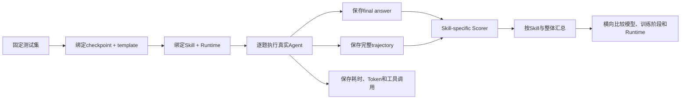
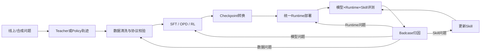

# 第三阶段（下）：统一评测、Checkpoint 转换与部署闭环

> 本章只展示通用评测设计、公开框架和重新整理的结果口径。真实测试集、Scorer 实现、内部接口、服务地址和模型权重不在本仓库中。

## 1. 训练 loss 下降为什么不能直接写进简历

Agent 模型的训练目标和业务目标之间存在多层距离：

```text
token loss下降
≠ tool-call格式一定合法
≠ Skill一定选对
≠ 工具参数一定正确
≠ 工具返回一定被正确使用
≠ 最终任务一定完成
```

SFT 的 token accuracy 衡量标准轨迹上的 next-token 命中；OPD 的 student-teacher overlap 衡量分布接近程度；RL 的训练 reward 衡量当前采样组中的任务表现。三者都不是完整线上质量。

因此，所有 checkpoint 最后都要回到同一套 Agent 任务中，真正执行 Skill 和工具，再比较结果。

## 2. 一次可比较评测需要固定什么

我把评测对象定义成一个完整组合，而不是只有模型名：

```text
Model checkpoint
× Tokenizer / Template
× Agent Runtime
× Skill version
× Tool environment
× Test set version
× Scorer version
× Generation config
```

其中任意一项变化，都可能改变最终轨迹。最小实验标识应至少包含：

```text
model_id
checkpoint_step
runtime
skill_version
dataset_version
scorer_version
thinking_mode
temperature
max_turns / max_tokens
```

只写“4B 模型 F1 为 68”没有可复现意义。相同 checkpoint 在 Claude Code SDK 与 OpenCode 中，可能因为消息模板、工具参数转换和上下文维护方式不同而产生不同分数。

## 3. 直接模型评测链路



每条评测记录至少需要保存：

```json
{
  "sample_id": "stable-id",
  "model": "checkpoint-alias",
  "runtime": "claude-code-sdk",
  "skill": "financial-indicator",
  "status": "success",
  "final_answer": "...",
  "trajectory": ["..."],
  "execution_metrics": {
    "latency_s": 0.0,
    "input_tokens": 0,
    "output_tokens": 0,
    "tool_calls": 0,
    "turns": 0
  },
  "score": {"primary_metric": 0.0}
}
```

最终答案用于判定任务是否完成；trajectory 用于定位 Skill、参数和工具使用；执行指标用于衡量成本与稳定性。三类信息不能互相替代。

## 4. 为什么每种 Skill 不能共用一个粗糙 Judge

不同任务的正确性结构不同。统一评测平台可以共用调度和产物格式，但主 Scorer 应按任务设计：

| 任务形态 | 代表性主指标 | 为什么适合 |
| --- | --- | --- |
| 指标集合查询 | Tag / Set F1 | 同时衡量漏查和多查 |
| 结构化表格 | Cell / Table F1 | 检查列、日期、单位和具体单元格 |
| 新闻检索 | Filter Match / Recall | 关注目标文档覆盖和筛选条件 |
| 公告与研报问答 | Fast Judge / LLM Judge | 判断要点覆盖和证据支持 |
| 专题报表定位 | Hit@1 | 目标通常是唯一报表代码 |
| 多字段页面任务 | Macro F1 | 聚合多个字段的结构化正确率 |

同一任务历史上也可能有多个分数，例如新闻的 filter match、process score 和旧版 Judge。它们定义不同，不能在一张趋势图中直接拼接。Scorer 版本必须与分数一起保存。

Token、tool call 次数和耗时属于执行指标，不是业务质量分。调用更少不一定更正确，调用更多也不一定表示模型更有能力。

## 5. 评测平台与 Agent 执行器的边界

项目中还存在一种平台交付链：平台本身不负责调用 Agent，只读取已经生成的产物并判分。

```text
Trial
├── agent/final.txt
├── agent/trajectory.json
└── verifier/rubric_reward.json
```

| 链路 | 负责执行 Agent | 负责判分 | 适用场景 |
| --- | --- | --- | --- |
| 直接模型评测 | 是 | 是 | 模型横向对比、Runtime 回归、调试轨迹 |
| 平台 Scorer | 否，读取既有产物 | 是 | 标准化交付、统一 Rubric 验收 |

只有拿到平台实际生成的 `rubric_reward.json`，才能称为正式平台结果。本地脚本能够读取文件，不等于平台任务已经执行成功。

输入口径也必须一致。如果直接评测使用干净 Query，而平台 Case 仍带有额外长指令，两边即使题目来源相同，分数也不能直接混比。

## 6. 失败首先要分层，而不是全部算模型错误

| 层次 | 例子 | 是否能直接归因模型质量 |
| --- | --- | --- |
| 可达性 | 服务未启动、网络超时、连接重置 | 否 |
| 认证 | Token 过期、权限不足 | 否 |
| Runtime | 消息协议不兼容、Parser 报错、进程泄漏 | 通常否 |
| 上下文 | 超过最大长度、模板膨胀 | 部分属于系统设计 |
| 工具环境 | 工具返回空、上游服务异常 | 需要单独标记 |
| Agent 行为 | Skill 选错、参数错误、循环调用 | 是 |
| 业务答案 | 数据已取到，但计算或回答错误 | 是 |

错误归因与端到端计分是两件事。每条结果应同时保存执行 `status`、业务分数和失败原因；执行成功也不等于业务回答正确。

正式比较需要同时保留三个视角：

1. **全量端到端表现**：固定所有题目、尝试预算与重试规则，明确失败如何计分。若采用失败为 0 的服务效用口径，需要说明这是系统指标，不能把所有失败归因于模型。
2. **执行分布**：报告完成数、覆盖率，以及网络、认证、Runtime、上下文、工具和 Agent 行为等失败类别。
3. **可比样本上的业务质量**：若排除环境故障，必须列出共同题目集合、排除规则与覆盖率；不能只取各模型自己的成功样本来排名。

例如两套系统分别完成 90/100 与 60/100 题，即使成功子集上的质量相同，端到端服务能力也不同。这个例子是统计口径说明，不是项目实测数据。

## 7. 怎样读模型 × Runtime × Skill 表

一个整体平均分可能掩盖完全不同的行为。因此我保留三个层级：

1. **模型 × Runtime × Skill**：观察具体能力与协议迁移；
2. **模型 × Runtime 整体平均**：看综合能力；
3. **执行分布**：耗时、Token、轮数、tool call、失败率。

建议对比表：

| checkpoint | runtime | indicator F1 | table F1 | news | report | overall | latency | failure rate |
| --- | --- | ---: | ---: | ---: | ---: | ---: | ---: | ---: |
| base | Runtime A | … | … | … | … | … | … | … |
| SFT | Runtime A | … | … | … | … | … | … | … |
| OPD / RL | Runtime A | … | … | … | … | … | … | … |
| same checkpoint | Runtime B | … | … | … | … | … | … | … |

如果同一 checkpoint 在两个 Runtime 中差距很大，优先检查 template、tool schema 映射、Skill 加载方式、并行调用表示和失败恢复，而不是立即重新训练模型。

## 8. 阶段性结果应该怎样表述

阶段总览原表使用 **Claude Code SDK**，覆盖指标检索、结构化表格、新闻、公告、研报、专题报表六类任务；模型标签为 SFT-4B、RL-4B、SFT-35B、RL-35B：

| 模型规模标签 | SFT Average F1 | RL Average F1（源表标签） | 提升 |
| --- | ---: | ---: | ---: |
| 4B | 63.28 | 67.97 | +4.69 个百分点 |
| 35B | 72.06 | 73.81 | +1.75 个百分点 |

这组数字记录了两种规模在该轮总览中的提升，但不能反推出每个 Skill 都提升，也不能与不同 Runtime、不同 Skill 集合或后续版本的明细表混成一条曲线。Average F1 沿用源表名称；完整任务评分与聚合实现未公开，不自行假定权重或统一 F1 公式。

源表没有附 checkpoint 与完整实验配置，因而不能把 RL-4B 直接解释成第四章的 pure OPD，也不能将 RL-35B 自动对应为另一基座的 MoE LoRA RL。实现线与结果线分开列在 [实验索引](06-experiment-index.md)。

4B 这行的绝对增益更大，这是表中能直接观察到的现象。模型大小、数据配方、训练设置和任务基线可能共同影响增益；没有控制变量的证据时，不把原因归结为“小模型更容易受益”或“距离教师更远”。

项目材料中还有其他版本分数与性能结果，但其测试集、Runtime 或 Scorer 口径尚未完全对齐。这里不把这些数字拼入主表，避免把不同实验误写成连续提升。

### 8.1 低成本与低延迟需要另一组证据

训练专用模型的目标包含降低服务成本与延迟，F1 提升本身不能证明这两个目标已经实现。性能比较应固定任务、质量目标、硬件与模型部署方式、并发、缓存冷热状态、长度限制和重试政策，再报告端到端耗时分布、Token、工具等待和吞吐。比较外部 API 与自部署服务时，计费成本和 GPU 时间也要分别定义。

当前公开记录不足以重算同口径性能收益，因此这里只保留工程目标，不把性能估计写入已验证结果。

## 9. OPD 的对齐指标不是业务准确率

OPD 可以观察学生与教师 Top-K token 分布的重合程度。它回答的是“学生分布是否更接近教师”，不能回答“Agent 任务成功率提高了多少”。

因此，Top-K overlap 上升只能作为训练诊断。OPD checkpoint 仍要进入统一 Skill 评测，检查：

- Skill 路由准确率；
- tool-call 格式合法率；
- 工具参数正确率；
- 任务成功率和最终答案；
- 平均轮数、Token、延迟与失败率。

同理，RL 训练 reward 上升可能来自训练题上的策略适应，需要在固定、未参与采样的验证集上确认泛化。

## 10. Checkpoint 为什么有三种形态

### Hugging Face checkpoint

```text
config.json
tokenizer.json
chat_template.jinja
model-*.safetensors
model.safetensors.index.json
```

适合 Transformers、SGLang 和 vLLM 推理，也便于检查 tokenizer 与 template。

### Megatron / torch_dist checkpoint

权重按 TP、PP、EP 和优化器需要分片，适合高性能训练，不能直接当普通 HF 目录交给 vLLM。

### LoRA adapter

```text
adapter_config.json
adapter_model.safetensors
```

只保存相对 Base Model 的低秩增量。部署时必须同时提供匹配的 Base Model。

典型转换链：

```text
SFT HF checkpoint
→ HF to torch_dist
→ Megatron OPD训练
→ torch_dist to HF
→ vLLM部署

Base Model + Megatron LoRA checkpoint
→ 导出HF adapter
→ Base + adapter动态加载
```

转换后至少检查：

1. 参数 Key 与 Tensor Shape 是否完整；
2. 相同 Prompt 下转换前后 logits 或生成是否接近；
3. tokenizer、template 与特殊 token 是否一起保留；
4. Adapter 是否只包含部署 Loader 支持的权重类型。

如果 Adapter 除 LoRA A/B 外还包含训练过的普通标量，通用 vLLM LoRA Loader 可能拒绝加载。不能为了“能挂载”就删除这些参数并声称模型等价；要么在训练侧导出纯 LoRA，要么扩展部署 Loader。

## 11. vLLM 服务启动时每个参数控制什么

下面仅展示部署脚本的调用约定，`serve_model.sh` 不随本笔记提供，不是本仓库可直接运行的命令。实际参数应以目标 vLLM 版本为准：

```bash
MODEL=/path/to/checkpoint \
SERVED_MODEL_NAME=financial-agent \
GPUS=0,1 \
TP=2 \
bash serve_model.sh start
```

| 参数 | 作用 |
| --- | --- |
| `--model` | 加载目标 checkpoint |
| `--tokenizer` | 保证 token 与 chat template 匹配 |
| `--served-model-name` | API 请求使用的模型别名 |
| `--tensor-parallel-size` | 将权重切到多张 GPU |
| `--dtype bfloat16` | 推理权重与计算精度 |
| `--max-model-len` | API 允许的最大上下文 |
| `--gpu-memory-utilization` | 模型、KV cache 等显存预算 |
| `--enable-prefix-caching` | 复用重复 System / Skill 前缀的 KV cache |
| `--max-num-batched-tokens` | 一次调度可处理的总 token 上限 |
| `--enable-auto-tool-choice` | 允许模型输出结构化工具调用 |
| `--tool-call-parser` | 将模型协议解析成 Runtime tool call |
| `--chat-template` | 决定角色、thinking 和工具 token 形式 |
| `--language-model-only` | 多模态模型只启用语言部分时节省资源 |
| `--no-enable-log-requests` | 不记录请求正文，减少日志泄露风险 |

服务脚本还应处理 PID、端口、日志、重复启动、状态检查和停止。能启动进程只是第一步；还需要通过最小 Agent smoke test 验证工具调用能够真正被 Parser 和 Runtime 接收。

## 12. Prefix caching 为什么适合 Skill Agent

不同 Agent 请求常共享很长的 System Prompt、工具 Schema、Skill 内容和多轮历史前缀。vLLM 可以复用相同前缀已经计算的 KV cache，降低 prefill 延迟。

但缓存命中要求 token 前缀完全一致。System 中一个动态时间戳、工具排序变化或模板空格差异，都可能使后续缓存失效。因此还要稳定：

- Tool Schema 排序；
- Skill 内容版本；
- Chat template；
- 动态字段插入位置；
- thinking 前缀。

## 13. 训练和部署协议不一致会怎样

| 不一致 | 可能结果 |
| --- | --- |
| 训练使用一种 tool-call XML，部署 Parser 期待另一种格式 | 工具调用被当成普通文本 |
| 训练有 think，部署强行补不同的 no-think 前缀 | 首 token 分布和停止行为改变 |
| tokenizer 不一致 | 特殊 token ID 错位 |
| stop token 不一致 | 调用被截断或模型不停生成 |
| Runtime 工具参数名不同 | Schema 校验失败 |
| Tool result 包装不同 | 下一轮模型无法识别环境反馈 |

我最终把“模型版本”扩展成一个部署 Bundle：

```text
weights
+ tokenizer
+ chat template
+ thinking mode
+ tool parser
+ Skill version
+ Runtime adapter
+ generation config
```

只有这个 Bundle 整体通过评测，checkpoint 才算可用。

## 14. 部署后的最小验收

```text
1. 健康检查或最小文本请求可用
2. 模型名与 checkpoint metadata 一致
3. 单次 Skill 调用能被解析并执行
4. 单个工具调用的参数合法
5. 同一 assistant turn 的多个调用保持结构
6. Tool result 能进入下一轮上下文
7. 最终回答能正常停止
8. 长上下文和最大轮数有明确失败状态
9. 不记录凭据、完整工具返回和敏感请求正文
10. 固定 smoke set 与离线 Harness 结果一致
```

对于 LoRA 还要检查 Base 与 Adapter 是否匹配、Loader 是否接受全部权重、动态卸载后 Base 行为是否恢复，以及多 Adapter 是否发生名称或缓存串扰。

## 15. 这一阶段怎样形成真正闭环



错误不再笼统地回到“再训练一次”：标签或轨迹错，回到数据；路径策略错，回到 Skill；模型在正确协议下仍不会，回到训练；跨 Runtime 漂移，回到 Adapter 和 Template；服务超时或解析失败，回到部署。

## 16. 我在这一阶段真正学到什么

1. Agent 后训练是数据、模板、Runtime、工具、Reward、分布式训练和评测共同组成的系统。
2. SFT、OPD 和 RL 的监督对象不同，不能因为都复用了 PPO/GRPO 基础设施就混成一种算法。
3. Student、Teacher、Actor 和 Rollout Engine 之间的 token 对齐，比文本看起来相似更重要。
4. MoE 每 token 激活参数少，不代表全参训练状态少；ZeRO-3、SP、PP、EP、CP 解决不同瓶颈。
5. 训练 loss、蒸馏 overlap 和在线 reward 都是中间信号，最终仍要做真实 Agent 任务评测。
6. 可部署模型不是单独的权重文件，而是 weights、tokenizer、template、parser、Skill 和 Runtime 的版本化组合。

---

[返回首页](../README.md) · [项目地图](00-project-map.md) · [实验与数据口径](06-experiment-index.md)
